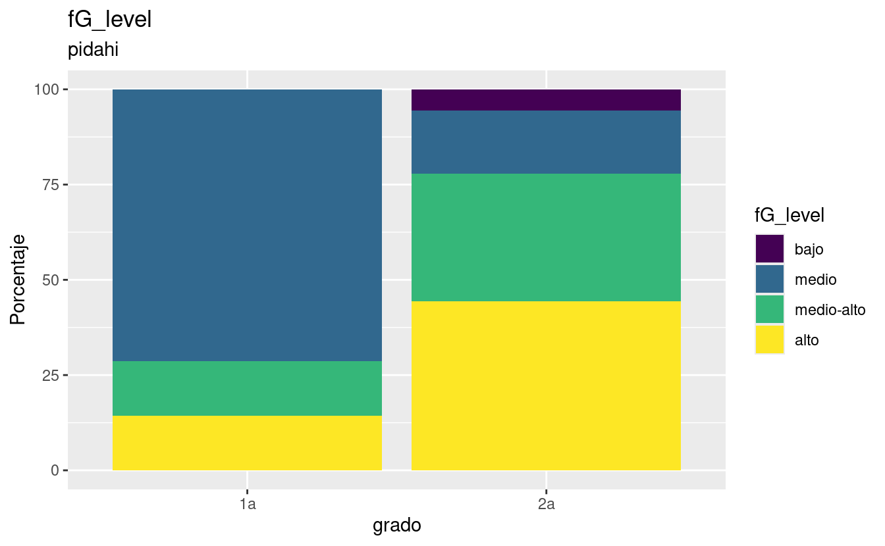
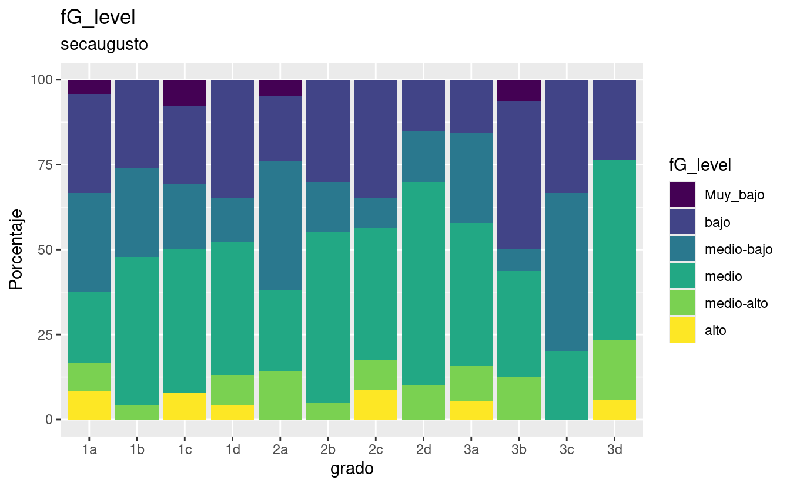
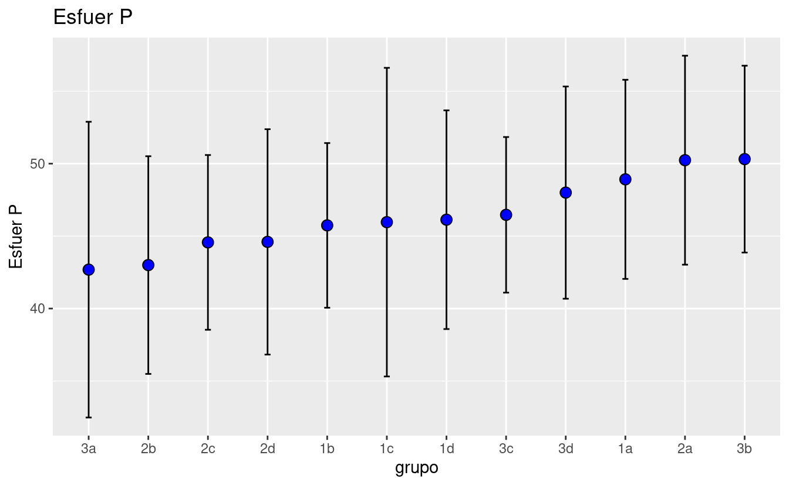
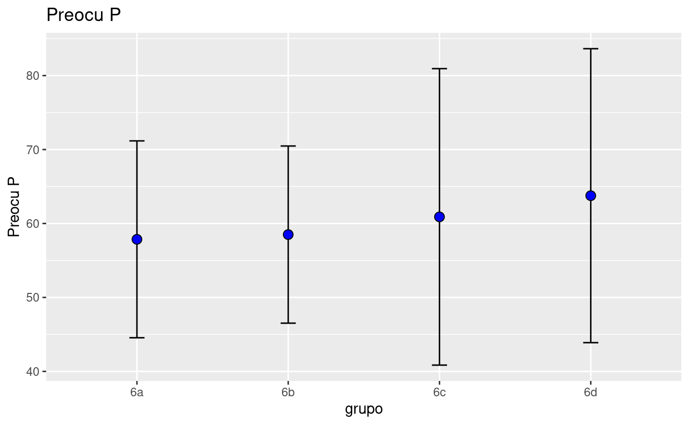
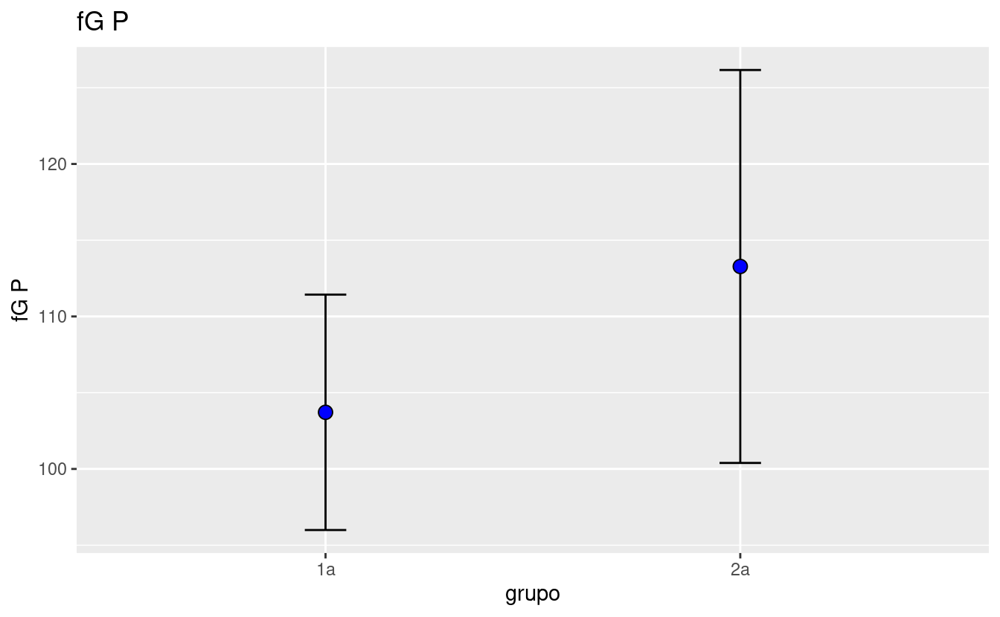

# OUTLIERS BY SCHOOL

<pre class='chroma'><code class='language-r' data-lang='r'>#&gt; $Esfuer
#&gt; $Esfuer$pidahi
#&gt;      escuela grado          id Esfuer
#&gt; 1269  pidahi    1a DIF1a2dma1s     22
#&gt; $fG
#&gt; $fG$primcongreso
#&gt;          escuela grado          id fG
#&gt; 298 primcongreso    6c PCC6c2rcc1n 60
#&gt; 
#&gt; 
#&gt; $Tenaci
#&gt; $Tenaci$primcongreso
#&gt;          escuela grado          id Tenaci
#&gt; 259 primcongreso    6a PCC6a2jgf1n 1.5625
#&gt; 286 primcongreso    6c PCC6c2chd1n 1.2500
#&gt; 291 primcongreso    6c PCC6c2gnr1n 1.5625
#&gt; 
#&gt; 
#&gt; $Esfuer
#&gt; $Esfuer$primcongreso
#&gt;          escuela grado          id Esfuer
#&gt; 286 primcongreso    6c PCC6c2chd1n     13
#&gt; 
#&gt; 
#&gt; $Preocu
#&gt; $Preocu$primcongreso
#&gt;          escuela grado          id Preocu
#&gt; 318 primcongreso    6d PCC6d2mfr1n    109
#&gt; $fG
#&gt; $fG$secaugusto
#&gt;        escuela grado          id fG
#&gt; 186 secaugusto    1c ACS1c2ked1n 55
#&gt; 
#&gt; 
#&gt; $Tenaci
#&gt; $Tenaci$secaugusto
#&gt;        escuela grado          id  Tenaci
#&gt; 41  secaugusto    3b ACS3b2jrv1n 4.84375
#&gt; 84  secaugusto    2d ACS2d2btc1n 1.25000
#&gt; 139 secaugusto    2a ACS2a2lgq1n 4.84375
#&gt; 152 secaugusto    2a ACS2a2amm1n 5.00000
#&gt; 171 secaugusto    1d ACS1d2asv1n 4.84375
#&gt; 176 secaugusto    1c ACS1c2zja1n 5.00000
#&gt; 177 secaugusto    1c ACS1c2vev1n 4.84375
#&gt; 223 secaugusto    1b ACS1b2ach1n 1.25000
#&gt; 
#&gt; 
#&gt; $Esfuer
#&gt; $Esfuer$secaugusto
#&gt;        escuela grado          id Esfuer
#&gt; 50  secaugusto    3a ACS3a2ubr1n     15
#&gt; 181 secaugusto    1c ACS1c2rga1n     22
#&gt; 186 secaugusto    1c ACS1c2ked1n     22
</code></pre>

# USAGE DOCUMENTATION

## TABLES EXAMPLES

To show a level-percentage table by school: The elements of the list - First element:

\[1\] "andes" "bicentenario" "cepac" "coltec"

\[5\] "diosa" "esperanza" "pidahi" "primcongreso"

\[9\] "secaugusto" "villavicencio"

-   Second element:

\[1\] "fG_level" "grit_level" "esfuerzo_level"

\[4\] "preocupacion_level"

| grado | medio | medio-alto | alto | bajo |
|:------|------:|-----------:|-----:|-----:|
| 1a    |  71.4 |       14.3 | 14.3 |   NA |
| 2a    |  16.7 |       33.3 | 44.4 |  5.6 |

Nivel de Inteligencia

## Showing a mean-sd table by school

| grado |  fG P | fG d | Tenaci P | Tenaci d | Esfuer P | Esfuer d | Preocu P | Preocu d |
|:------|------:|-----:|---------:|---------:|---------:|---------:|---------:|---------:|
| 1a    | 103.7 |  7.7 |      3.4 |      0.5 |     49.9 |     14.6 |     63.9 |     20.5 |
| 2a    | 113.3 | 12.9 |      3.2 |      0.5 |     45.4 |      6.4 |     54.9 |     15.1 |

PIDAHI

| grado | fG P | fG d | Tenaci P | Tenaci d | Esfuer P | Esfuer d | Preocu P | Preocu d |
|:------|-----:|-----:|---------:|---------:|---------:|---------:|---------:|---------:|
| 6a    | 94.0 | 11.4 |      2.7 |      0.6 |     43.4 |      6.4 |     57.9 |     13.3 |
| 6b    | 97.2 |  7.5 |      3.0 |      0.5 |     46.4 |      7.2 |     58.5 |     12.0 |
| 6c    | 95.5 | 18.2 |      2.7 |      0.7 |     44.1 |     10.6 |     60.9 |     20.0 |
| 6d    | 96.9 | 12.7 |      3.2 |      0.6 |     46.4 |      8.4 |     63.8 |     19.9 |

Congreso

| grado | fG P | fG d | Tenaci P | Tenaci d | Esfuer P | Esfuer d | Preocu P | Preocu d |
|:------|-----:|-----:|---------:|---------:|---------:|---------:|---------:|---------:|
| 1a    | 91.5 | 13.0 |      3.2 |      0.6 |     48.9 |      6.9 |     66.7 |     17.1 |
| 1b    | 91.8 |  9.1 |      3.0 |      0.6 |     45.7 |      5.7 |     65.3 |     14.5 |
| 1c    | 92.0 | 15.0 |      3.3 |      0.8 |     46.0 |     10.6 |     63.2 |     16.1 |
| 1d    | 93.5 | 11.4 |      2.9 |      0.8 |     46.1 |      7.5 |     59.7 |     11.3 |
| 2a    | 91.4 | 11.0 |      3.3 |      0.7 |     50.2 |      7.2 |     66.3 |     14.3 |
| 2b    | 92.8 | 11.9 |      2.9 |      0.6 |     43.0 |      7.5 |     56.5 |     13.7 |
| 2c    | 93.3 | 13.8 |      3.1 |      0.5 |     44.6 |      6.0 |     59.4 |     10.9 |
| 2d    | 95.8 | 10.1 |      3.0 |      0.7 |     44.6 |      7.8 |     60.7 |     13.5 |
| 3a    | 95.1 |  9.8 |      3.0 |      0.4 |     42.7 |     10.2 |     61.6 |     18.5 |
| 3b    | 89.2 | 13.4 |      3.3 |      0.6 |     50.3 |      6.4 |     64.4 |     15.2 |
| 3c    | 88.3 |  8.5 |      3.1 |      0.5 |     46.5 |      5.4 |     64.5 |     13.3 |
| 3d    | 95.6 | 13.6 |      3.1 |      0.6 |     48.0 |      7.3 |     63.4 |     13.8 |

Augusto

## GRAPHICS EXAMPLES

Showing a level-percentage graphic: Use the same elements as the level-percent table, but set 'graph' in the last element.

## MEAN AND SD GRAPHS

Showing a main-sd point inverval plot: - First element is school name same as examples above.

-   Second elemnt:

"fG" "Tenaci" "Esfuer" "Preocu"

# Mafer's REPORT

El presente informe es una síntesis de los hallazgos producto del análisis de las pruebas de perfeccionismo y tenacidad, aplicadas a los estudiantes de su institución de los grados 1° a 3°, quienes participaron en éste ejercicio, mediante el cual se busca brindarles información valiosa de los estudiantes, que sirvan de complemento a otras medidas y datos disponibles, favoreciendo el diseño e implementación de estrategias de orientación psicoeducativa. Es importante aclarar que se trata de resultados preliminares, dado que las pruebas se encuentran en proceso de validación. A continuación se presenta una breve información sobre las variables y las pruebas, con referencia a la población de la propia institución y con el fin de ayudarles en la interpretación de los datos: IMPORTANTE: Estos resultados deben ser usados únicamente en pro de los estudiantes y nunca con fines de discriminación ni diagnóstico.

