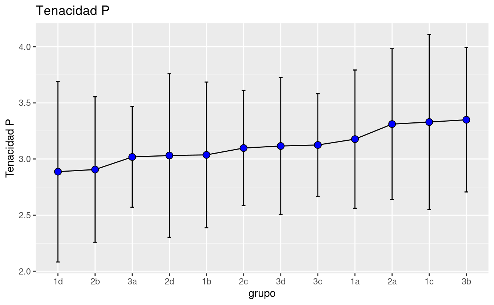
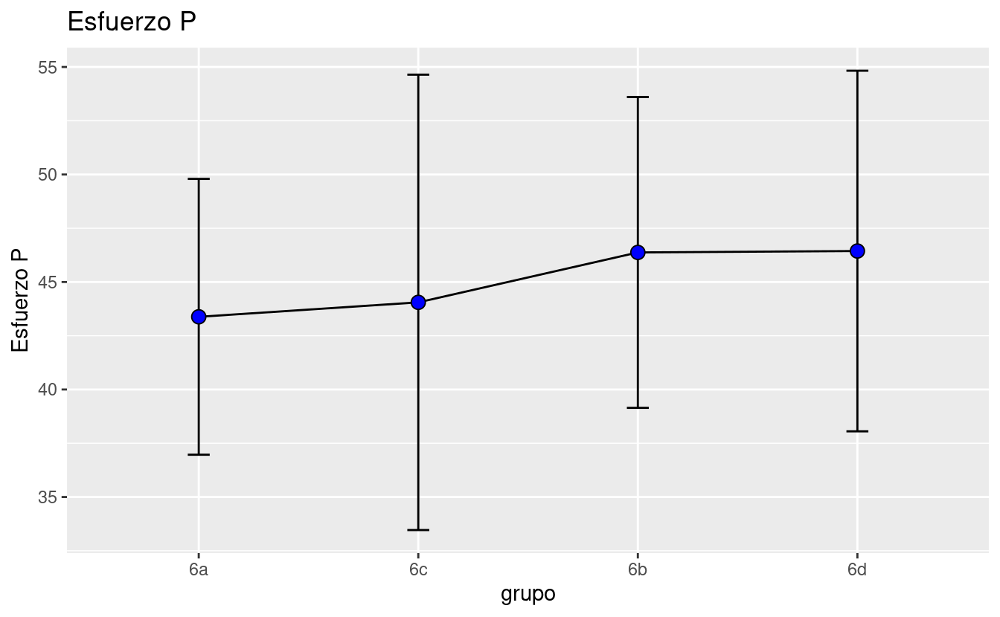
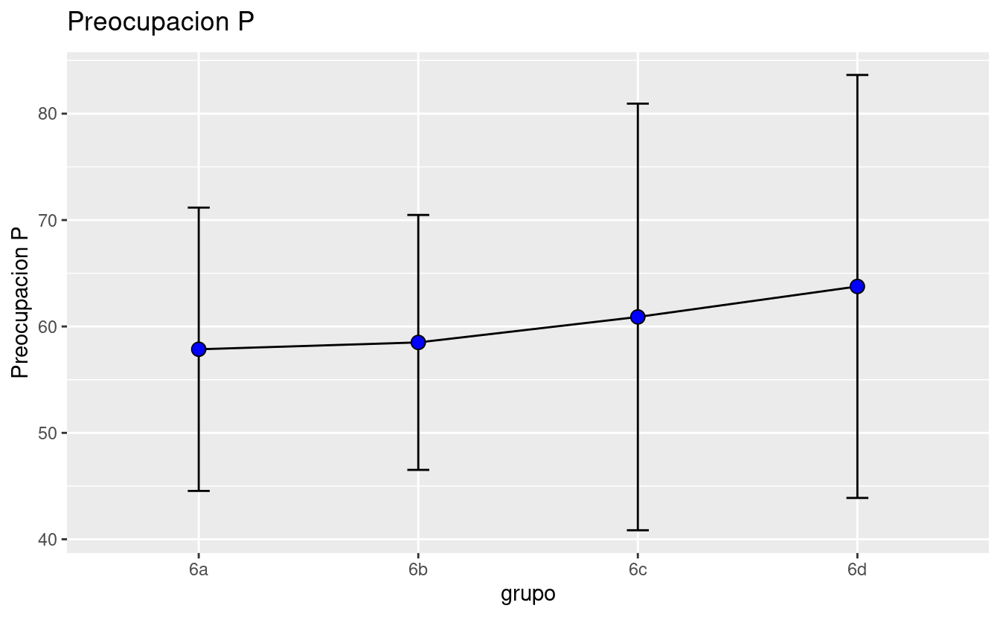
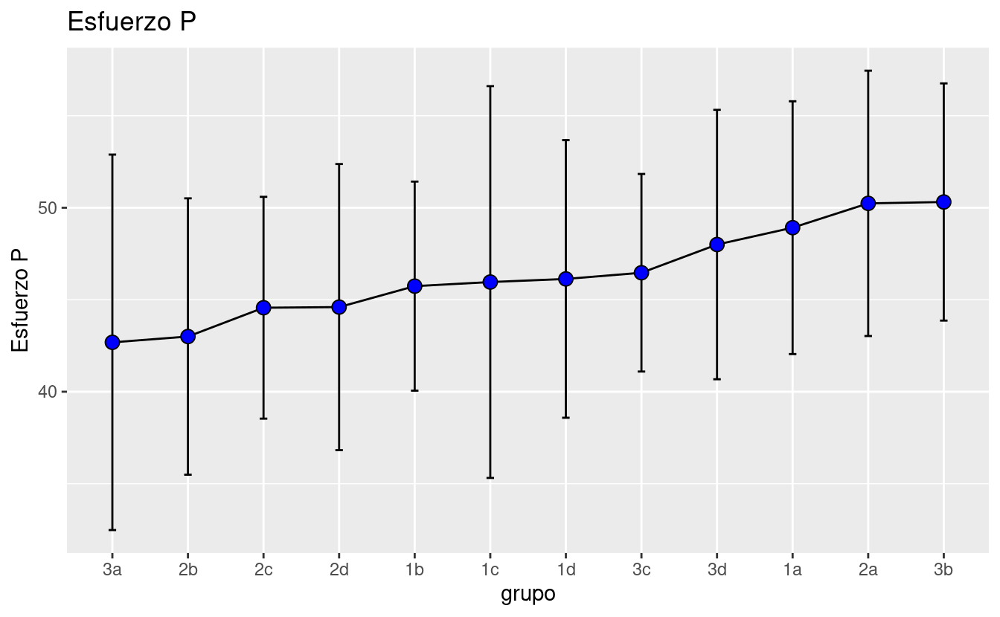
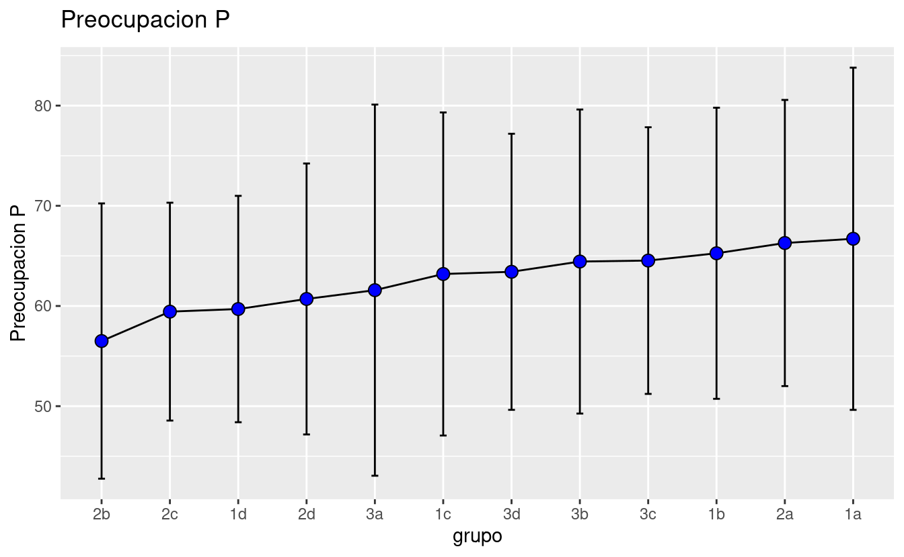

# OUTLIERS BY SCHOOL

## PIDAHI

<pre class='chroma'><code class='language-r' data-lang='r'>outliers_pidahi
#&gt; $Esfuerzo
#&gt; $Esfuerzo$pidahi
#&gt;      escuela grado          id Esfuerzo
#&gt; 1269  pidahi    1a DIF1a2dma1s       22
</code></pre>

## CONGRESO

<pre class='chroma'><code class='language-r' data-lang='r'>outliers_primcongreso
#&gt; $fG
#&gt; $fG$primcongreso
#&gt;          escuela grado          id fG
#&gt; 298 primcongreso    6c PCC6c2rcc1n 60
#&gt; 
#&gt; 
#&gt; $Tenacidad
#&gt; $Tenacidad$primcongreso
#&gt;          escuela grado          id Tenacidad
#&gt; 259 primcongreso    6a PCC6a2jgf1n    1.5625
#&gt; 286 primcongreso    6c PCC6c2chd1n    1.2500
#&gt; 291 primcongreso    6c PCC6c2gnr1n    1.5625
#&gt; 
#&gt; 
#&gt; $Esfuerzo
#&gt; $Esfuerzo$primcongreso
#&gt;          escuela grado          id Esfuerzo
#&gt; 286 primcongreso    6c PCC6c2chd1n       13
#&gt; 
#&gt; 
#&gt; $Preocupacion
#&gt; $Preocupacion$primcongreso
#&gt;          escuela grado          id Preocupacion
#&gt; 318 primcongreso    6d PCC6d2mfr1n          109
</code></pre>

## AUGUSTO

<pre class='chroma'><code class='language-r' data-lang='r'>outliers_secaugusto
#&gt; $fG
#&gt; $fG$secaugusto
#&gt;        escuela grado          id fG
#&gt; 186 secaugusto    1c ACS1c2ked1n 55
#&gt; 
#&gt; 
#&gt; $Tenacidad
#&gt; $Tenacidad$secaugusto
#&gt;        escuela grado          id Tenacidad
#&gt; 41  secaugusto    3b ACS3b2jrv1n   4.84375
#&gt; 84  secaugusto    2d ACS2d2btc1n   1.25000
#&gt; 139 secaugusto    2a ACS2a2lgq1n   4.84375
#&gt; 152 secaugusto    2a ACS2a2amm1n   5.00000
#&gt; 171 secaugusto    1d ACS1d2asv1n   4.84375
#&gt; 176 secaugusto    1c ACS1c2zja1n   5.00000
#&gt; 177 secaugusto    1c ACS1c2vev1n   4.84375
#&gt; 223 secaugusto    1b ACS1b2ach1n   1.25000
#&gt; 
#&gt; 
#&gt; $Esfuerzo
#&gt; $Esfuerzo$secaugusto
#&gt;        escuela grado          id Esfuerzo
#&gt; 50  secaugusto    3a ACS3a2ubr1n       15
#&gt; 181 secaugusto    1c ACS1c2rga1n       22
#&gt; 186 secaugusto    1c ACS1c2ked1n       22
</code></pre>

# USAGE DOCUMENTATION

## TABLES EXAMPLES

To show a level-percentage table by school: The elements of the list

-   First element:

\[1\] "andes" "bicentenario" "cepac" "coltec"

\[5\] "diosa" "esperanza" "pidahi" "primcongreso"

\[9\] "secaugusto" "villavicencio"

-   Second element:

\[1\] "fG_level" "tenacidad_level" "esfuerzo_level"

\[4\] "preocupacion_level"

### Table Augusto Intelligence

-   Use "caption" field to modify the title.

| grado | Muy_bajo | bajo | medio-bajo | medio | medio-alto | alto |
|:------|---------:|-----:|-----------:|------:|-----------:|-----:|
| 1a    |      4.2 | 29.2 |       29.2 |  20.8 |        8.3 |  8.3 |
| 1b    |       NA | 26.1 |       26.1 |  43.5 |        4.3 |   NA |
| 1c    |      7.7 | 23.1 |       19.2 |  42.3 |         NA |  7.7 |
| 1d    |       NA | 34.8 |       13.0 |  39.1 |        8.7 |  4.3 |
| 2a    |      4.8 | 19.0 |       38.1 |  23.8 |       14.3 |   NA |
| 2b    |       NA | 30.0 |       15.0 |  50.0 |        5.0 |   NA |
| 2c    |       NA | 34.8 |        8.7 |  39.1 |        8.7 |  8.7 |
| 2d    |       NA | 15.0 |       15.0 |  60.0 |       10.0 |   NA |
| 3a    |       NA | 15.8 |       26.3 |  42.1 |       10.5 |  5.3 |
| 3b    |      6.2 | 43.8 |        6.2 |  31.2 |       12.5 |   NA |
| 3c    |       NA | 33.3 |       46.7 |  20.0 |         NA |   NA |
| 3d    |       NA | 23.5 |         NA |  52.9 |       17.6 |  5.9 |

Nivel de Inteligencia

### Table Augusto Tenacidad

-   Use "caption" field to modify the title.

| grado | Bajo | Medio | Alto |
|:------|-----:|------:|-----:|
| 1a    | 33.3 |  37.5 | 29.2 |
| 1b    | 47.8 |  26.1 | 26.1 |
| 1c    | 42.3 |  19.2 | 38.5 |
| 1d    | 69.6 |  13.0 | 17.4 |
| 2a    | 38.1 |  33.3 | 28.6 |
| 2b    | 60.0 |  25.0 | 15.0 |
| 2c    | 47.8 |  34.8 | 17.4 |
| 2d    | 60.0 |  10.0 | 30.0 |
| 3a    | 42.1 |  52.6 |  5.3 |
| 3b    | 25.0 |  37.5 | 37.5 |
| 3c    | 46.7 |  33.3 | 20.0 |
| 3d    | 41.2 |  41.2 | 17.6 |

Nivel de Inteligencia

### Table Augusto Esfuerzo

-   Use "caption" field to modify the title.

| grado | Bajo | Medio | Alto | Superior |
|:------|-----:|------:|-----:|---------:|
| 1a    | 16.7 |  20.8 | 41.7 |     20.8 |
| 1b    | 26.1 |  34.8 | 30.4 |      8.7 |
| 1c    | 30.8 |  15.4 | 23.1 |     30.8 |
| 1d    | 30.4 |  21.7 | 34.8 |     13.0 |
| 2a    | 14.3 |  23.8 | 19.0 |     42.9 |
| 2b    | 40.0 |  30.0 | 20.0 |     10.0 |
| 2c    | 26.1 |  47.8 | 21.7 |      4.3 |
| 2d    | 30.0 |  40.0 | 15.0 |     15.0 |
| 3a    | 31.6 |  36.8 | 21.1 |     10.5 |
| 3b    |  6.2 |  25.0 | 43.8 |     25.0 |
| 3c    | 13.3 |  46.7 | 33.3 |      6.7 |
| 3d    | 17.6 |  23.5 | 35.3 |     23.5 |

Nivel de Inteligencia

### Table Augusto Preocupacion

-   Use "caption" field to modify the title.

| grado | Bajo | Medio | Alto | Superior |
|:------|-----:|------:|-----:|---------:|
| 1a    | 20.8 |  20.8 | 25.0 |     33.3 |
| 1b    | 13.0 |  39.1 | 17.4 |     30.4 |
| 1c    | 15.4 |  38.5 | 23.1 |     23.1 |
| 1d    | 17.4 |  39.1 | 30.4 |     13.0 |
| 2a    | 14.3 |  23.8 | 42.9 |     19.0 |
| 2b    | 30.0 |  40.0 | 20.0 |     10.0 |
| 2c    | 21.7 |  26.1 | 47.8 |      4.3 |
| 2d    | 40.0 |  10.0 | 30.0 |     20.0 |
| 3a    | 31.6 |  26.3 | 21.1 |     21.1 |
| 3b    | 18.8 |  25.0 | 18.8 |     37.5 |
| 3c    | 13.3 |  33.3 | 33.3 |     20.0 |
| 3d    | 23.5 |  17.6 | 41.2 |     17.6 |

Nivel de Inteligencia

## Showing a mean-sd table by school

Note that there is only one mean-sd table by school

### Table Augusto

-   Use "caption" field to modify the title.

| grado | fG P | fG d | Tenacidad P | Tenacidad d | Esfuerzo P | Esfuerzo d | Preocupacion P | Preocupacion d |
|:-----|----:|----:|---------:|---------:|--------:|--------:|-----------:|-----------:|
| 1a    | 91.5 | 13.0 |         3.2 |         0.6 |       48.9 |        6.9 |           66.7 |           17.1 |
| 1b    | 91.8 |  9.1 |         3.0 |         0.6 |       45.7 |        5.7 |           65.3 |           14.5 |
| 1c    | 92.0 | 15.0 |         3.3 |         0.8 |       46.0 |       10.6 |           63.2 |           16.1 |
| 1d    | 93.5 | 11.4 |         2.9 |         0.8 |       46.1 |        7.5 |           59.7 |           11.3 |
| 2a    | 91.4 | 11.0 |         3.3 |         0.7 |       50.2 |        7.2 |           66.3 |           14.3 |
| 2b    | 92.8 | 11.9 |         2.9 |         0.6 |       43.0 |        7.5 |           56.5 |           13.7 |
| 2c    | 93.3 | 13.8 |         3.1 |         0.5 |       44.6 |        6.0 |           59.4 |           10.9 |
| 2d    | 95.8 | 10.1 |         3.0 |         0.7 |       44.6 |        7.8 |           60.7 |           13.5 |
| 3a    | 95.1 |  9.8 |         3.0 |         0.4 |       42.7 |       10.2 |           61.6 |           18.5 |
| 3b    | 89.2 | 13.4 |         3.3 |         0.6 |       50.3 |        6.4 |           64.4 |           15.2 |
| 3c    | 88.3 |  8.5 |         3.1 |         0.5 |       46.5 |        5.4 |           64.5 |           13.3 |
| 3d    | 95.6 | 13.6 |         3.1 |         0.6 |       48.0 |        7.3 |           63.4 |           13.8 |

Augusto

### Table Congreso

| grado | fG P | fG d | Tenacidad P | Tenacidad d | Esfuerzo P | Esfuerzo d | Preocupacion P | Preocupacion d |
|:-----|----:|----:|---------:|---------:|--------:|--------:|-----------:|-----------:|
| 6a    | 94.0 | 11.4 |         2.7 |         0.6 |       43.4 |        6.4 |           57.9 |           13.3 |
| 6b    | 97.2 |  7.5 |         3.0 |         0.5 |       46.4 |        7.2 |           58.5 |           12.0 |
| 6c    | 95.5 | 18.2 |         2.7 |         0.7 |       44.1 |       10.6 |           60.9 |           20.0 |
| 6d    | 96.9 | 12.7 |         3.2 |         0.6 |       46.4 |        8.4 |           63.8 |           19.9 |

Congreso

### Table Pidahi

| grado |  fG P | fG d | Tenacidad P | Tenacidad d | Esfuerzo P | Esfuerzo d | Preocupacion P | Preocupacion d |
|:-----|-----:|----:|---------:|---------:|--------:|--------:|-----------:|-----------:|
| 1a    | 103.7 |  7.7 |         3.4 |         0.5 |       49.9 |       14.6 |           63.9 |           20.5 |
| 2a    | 113.3 | 12.9 |         3.2 |         0.5 |       45.4 |        6.4 |           54.9 |           15.1 |

Pidahi

## GRAPHICS EXAMPLES

Showing a level-percentage graphic:

Use the same elements as the level-percent table, but set 'graph' in the last element.

### Percent-Levels Augusto Intelligence

### Percent-Levels Augusto Tenacity

### Percent-Levels Augusto Effort

### Percent-Levels Augusto Preoccupation

## MEAN AND SD GRAPHS

Showing a main-sd point inverval plot:

-   First element is school name same as examples above.

-   Second elemnt:

"fG" "Tenaci" "Esfuer" "Preocu"

### Example Augusto Intelligence

### Example Augusto Tenacidad

### Example Augusto Esfuerzo

### Example Augusto Preocupacion

# Mafer's REPORT

El presente informe es una síntesis de los hallazgos producto del análisis de las pruebas de perfeccionismo y tenacidad, aplicadas a los estudiantes de su institución de los grados 1° a 3°, quienes participaron en éste ejercicio, mediante el cual se busca brindarles información valiosa de los estudiantes, que sirvan de complemento a otras medidas y datos disponibles, favoreciendo el diseño e implementación de estrategias de orientación psicoeducativa. Es importante aclarar que se trata de resultados preliminares, dado que las pruebas se encuentran en proceso de validación. A continuación se presenta una breve información sobre las variables y las pruebas, con referencia a la población de la propia institución y con el fin de ayudarles en la interpretación de los datos: IMPORTANTE: Estos resultados deben ser usados únicamente en pro de los estudiantes y nunca con fines de discriminación ni diagnóstico.

