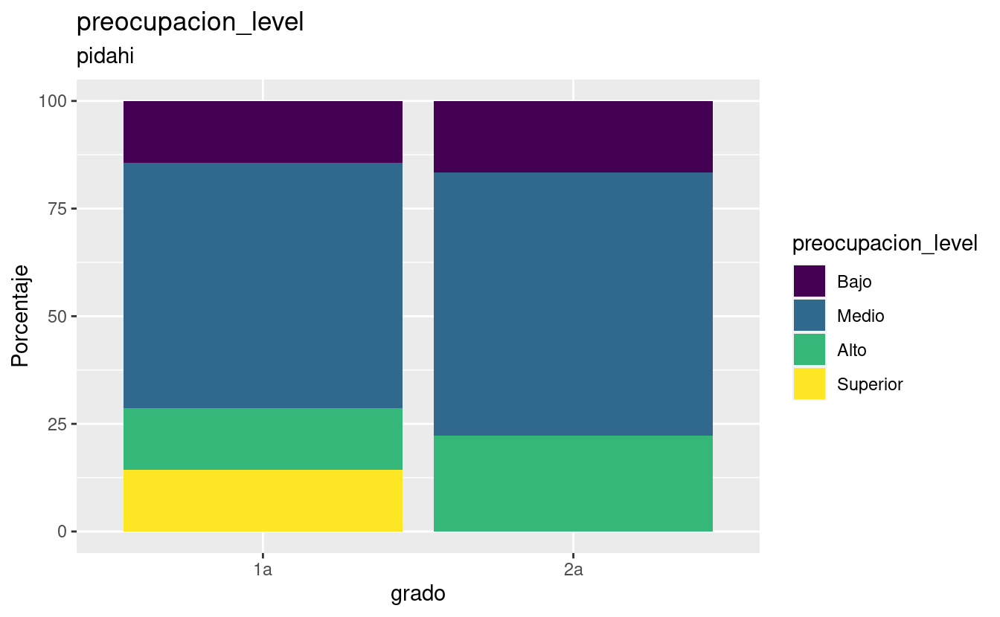

PROFILE - LEVELS
================

Results profiles and levels. \#\# table by schoo, raw version

<pre class='chroma'><code class='language-r' data-lang='r'>#&gt; [[1]]
#&gt; [[1]][[1]]
#&gt; [[1]][[1]][[1]]
#&gt; # A tibble: 3 × 5
#&gt; # Groups:   escuela, grado [3]
#&gt;   escuela grado Medio  Alto  Bajo
#&gt;   &lt;fct&gt;   &lt;fct&gt; &lt;dbl&gt; &lt;dbl&gt; &lt;dbl&gt;
#&gt; 1 pidahi  1a     71.4 28.6  NA   
#&gt; 2 pidahi  2     100   NA    NA   
#&gt; 3 pidahi  2a     88.2  5.88  5.88
#&gt; 
#&gt; [[1]][[1]][[2]]</code></pre>

<pre class='chroma'><code class='language-r' data-lang='r'>#&gt; 
#&gt; 
#&gt; [[1]][[2]]
#&gt; [[1]][[2]][[1]]
#&gt; # A tibble: 3 × 6
#&gt; # Groups:   escuela, grado [3]
#&gt;   escuela grado  Bajo  Alto Superior Medio
#&gt;   &lt;fct&gt;   &lt;fct&gt; &lt;dbl&gt; &lt;dbl&gt;    &lt;dbl&gt; &lt;dbl&gt;
#&gt; 1 pidahi  1a     14.3  28.6     57.1 NA   
#&gt; 2 pidahi  2      NA    NA      100   NA   
#&gt; 3 pidahi  2a     NA    64.7     29.4  5.88
#&gt; 
#&gt; [[1]][[2]][[2]]</code></pre>

<pre class='chroma'><code class='language-r' data-lang='r'>#&gt; 
#&gt; 
#&gt; [[1]][[3]]
#&gt; [[1]][[3]][[1]]
#&gt; # A tibble: 3 × 6
#&gt; # Groups:   escuela, grado [3]
#&gt;   escuela grado  Bajo Medio  Alto Superior
#&gt;   &lt;fct&gt;   &lt;fct&gt; &lt;dbl&gt; &lt;dbl&gt; &lt;dbl&gt;    &lt;dbl&gt;
#&gt; 1 pidahi  1a     14.3  57.1  14.3     14.3
#&gt; 2 pidahi  2     100    NA    NA       NA  
#&gt; 3 pidahi  2a     11.8  64.7  23.5     NA  
#&gt; 
#&gt; [[1]][[3]][[2]]</code></pre>

<pre class='chroma'><code class='language-r' data-lang='r'>#&gt; 
#&gt; 
#&gt; 
#&gt; [[2]]
#&gt; [[2]][[1]]
#&gt; [[2]][[1]][[1]]
#&gt; # A tibble: 4 × 5
#&gt; # Groups:   escuela, grado [4]
#&gt;   escuela      grado  Bajo Medio  Alto
#&gt;   &lt;fct&gt;        &lt;fct&gt; &lt;dbl&gt; &lt;dbl&gt; &lt;dbl&gt;
#&gt; 1 primcongreso 6a    33.3   66.7 NA   
#&gt; 2 primcongreso 6b     6.25  87.5  6.25
#&gt; 3 primcongreso 6c    42.1   57.9 NA   
#&gt; 4 primcongreso 6d     8     80   12   
#&gt; 
#&gt; [[2]][[1]][[2]]</code></pre>

<pre class='chroma'><code class='language-r' data-lang='r'>#&gt; 
#&gt; 
#&gt; [[2]][[2]]
#&gt; [[2]][[2]][[1]]
#&gt; # A tibble: 4 × 6
#&gt; # Groups:   escuela, grado [4]
#&gt;   escuela      grado Medio  Alto Superior  Bajo
#&gt;   &lt;fct&gt;        &lt;fct&gt; &lt;dbl&gt; &lt;dbl&gt;    &lt;dbl&gt; &lt;dbl&gt;
#&gt; 1 primcongreso 6a     23.8  57.1     19.0 NA   
#&gt; 2 primcongreso 6b     12.5  50       37.5 NA   
#&gt; 3 primcongreso 6c     15.8  42.1     36.8  5.26
#&gt; 4 primcongreso 6d      8    64       24    4   
#&gt; 
#&gt; [[2]][[2]][[2]]</code></pre>

<pre class='chroma'><code class='language-r' data-lang='r'>#&gt; 
#&gt; 
#&gt; [[2]][[3]]
#&gt; [[2]][[3]][[1]]
#&gt; # A tibble: 4 × 6
#&gt; # Groups:   escuela, grado [4]
#&gt;   escuela      grado  Bajo Medio  Alto Superior
#&gt;   &lt;fct&gt;        &lt;fct&gt; &lt;dbl&gt; &lt;dbl&gt; &lt;dbl&gt;    &lt;dbl&gt;
#&gt; 1 primcongreso 6a    14.3   66.7  19.0    NA   
#&gt; 2 primcongreso 6b     6.25  75    12.5     6.25
#&gt; 3 primcongreso 6c    15.8   42.1  31.6    10.5 
#&gt; 4 primcongreso 6d     8     44    40       8   
#&gt; 
#&gt; [[2]][[3]][[2]]</code></pre>

<pre class='chroma'><code class='language-r' data-lang='r'>#&gt; 
#&gt; 
#&gt; 
#&gt; [[3]]
#&gt; [[3]][[1]]
#&gt; [[3]][[1]][[1]]
#&gt; # A tibble: 12 × 5
#&gt; # Groups:   escuela, grado [12]
#&gt;    escuela    grado  Bajo Medio  Alto
#&gt;    &lt;fct&gt;      &lt;fct&gt; &lt;dbl&gt; &lt;dbl&gt; &lt;dbl&gt;
#&gt;  1 secaugusto 1a    12.5   70.8 16.7 
#&gt;  2 secaugusto 1b    17.4   78.3  4.35
#&gt;  3 secaugusto 1c    11.5   65.4 23.1 
#&gt;  4 secaugusto 1d    26.1   60.9 13.0 
#&gt;  5 secaugusto 2a    NA     81.0 19.0 
#&gt;  6 secaugusto 2b    25     70    5   
#&gt;  7 secaugusto 2c     8.70  82.6  8.70
#&gt;  8 secaugusto 2d    15     70   15   
#&gt;  9 secaugusto 3a    10.5   84.2  5.26
#&gt; 10 secaugusto 3b     6.25  75   18.8 
#&gt; 11 secaugusto 3c    NA     86.7 13.3 
#&gt; 12 secaugusto 3d    11.8   76.5 11.8 
#&gt; 
#&gt; [[3]][[1]][[2]]</code></pre>

<pre class='chroma'><code class='language-r' data-lang='r'>#&gt; 
#&gt; 
#&gt; [[3]][[2]]
#&gt; [[3]][[2]][[1]]
#&gt; # A tibble: 12 × 6
#&gt; # Groups:   escuela, grado [12]
#&gt;    escuela    grado Medio  Alto Superior  Bajo
#&gt;    &lt;fct&gt;      &lt;fct&gt; &lt;dbl&gt; &lt;dbl&gt;    &lt;dbl&gt; &lt;dbl&gt;
#&gt;  1 secaugusto 1a     8.33  45.8     45.8 NA   
#&gt;  2 secaugusto 1b    13.0   73.9     13.0 NA   
#&gt;  3 secaugusto 1c     7.69  50       34.6  7.69
#&gt;  4 secaugusto 1d    17.4   52.2     30.4 NA   
#&gt;  5 secaugusto 2a    NA     42.9     57.1 NA   
#&gt;  6 secaugusto 2b    25     55       20   NA   
#&gt;  7 secaugusto 2c    17.4   60.9     21.7 NA   
#&gt;  8 secaugusto 2d    20     60       20   NA   
#&gt;  9 secaugusto 3a    10.5   68.4     15.8  5.26
#&gt; 10 secaugusto 3b    NA     62.5     37.5 NA   
#&gt; 11 secaugusto 3c     6.67  73.3     20   NA   
#&gt; 12 secaugusto 3d    11.8   52.9     35.3 NA   
#&gt; 
#&gt; [[3]][[2]][[2]]</code></pre>

<pre class='chroma'><code class='language-r' data-lang='r'>#&gt; 
#&gt; 
#&gt; [[3]][[3]]
#&gt; [[3]][[3]][[1]]
#&gt; # A tibble: 12 × 6
#&gt; # Groups:   escuela, grado [12]
#&gt;    escuela    grado  Bajo Medio  Alto Superior
#&gt;    &lt;fct&gt;      &lt;fct&gt; &lt;dbl&gt; &lt;dbl&gt; &lt;dbl&gt;    &lt;dbl&gt;
#&gt;  1 secaugusto 1a     4.17  50    37.5     8.33
#&gt;  2 secaugusto 1b    NA     60.9  30.4     8.70
#&gt;  3 secaugusto 1c     3.85  57.7  30.8     7.69
#&gt;  4 secaugusto 1d    13.0   60.9  26.1    NA   
#&gt;  5 secaugusto 2a     4.76  42.9  42.9     9.52
#&gt;  6 secaugusto 2b    10     75    15      NA   
#&gt;  7 secaugusto 2c     8.70  73.9  17.4    NA   
#&gt;  8 secaugusto 2d     5     55    40      NA   
#&gt;  9 secaugusto 3a    10.5   57.9  15.8    15.8 
#&gt; 10 secaugusto 3b    12.5   37.5  43.8     6.25
#&gt; 11 secaugusto 3c     6.67  53.3  33.3     6.67
#&gt; 12 secaugusto 3d     5.88  47.1  47.1    NA   
#&gt; 
#&gt; [[3]][[3]][[2]]</code></pre>

<pre class='chroma'><code class='language-r' data-lang='r'>

</code></pre>

NUMERIC RESULTS
===============

MEANS AND LEVELS EMPF AND GRIT
------------------------------

<pre class='chroma'><code class='language-r' data-lang='r'>#&gt; [1] "==GRIT SD==:"#&gt;   grit_score esfuerzo_score preocupacion_score
#&gt; 1    3.28125             51                 63
#&gt; 2    2.65625             44                 46
#&gt; 3    3.59375             52                 52
#&gt; 4    3.28125             40                 61
#&gt; 5    3.12500             45                 62
#&gt; 6    3.12500             45                 44#&gt;   grit_level esfuerzo_level preocupacion_level
#&gt; 1      Medio       Superior              Medio
#&gt; 2      Medio           Alto              Medio
#&gt; 3      Medio       Superior              Medio
#&gt; 4      Medio           Alto              Medio
#&gt; 5      Medio           Alto              Medio
#&gt; 6      Medio           Alto              Medio</code></pre>

STACKED BARS FOR LEVELS OF EMPF AND GRIT
----------------------------------------

GRIT, ESFUERZO AND PREOCUPACION, PROPORTION VERSION.
----------------------------------------------------

BOXPLOTS GRIT
-------------

BOXPLOTS EMPF
-------------

