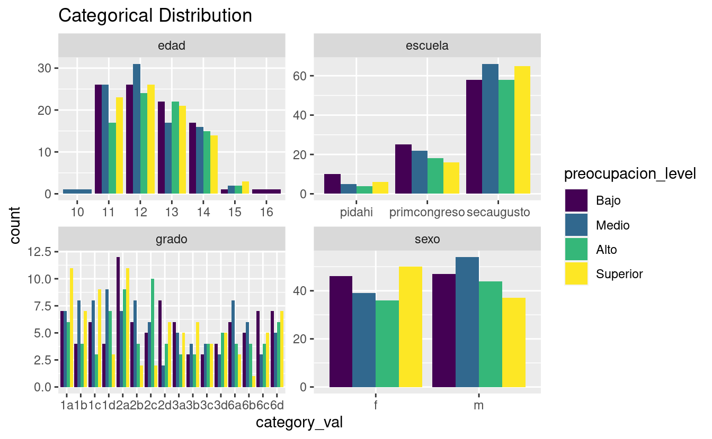
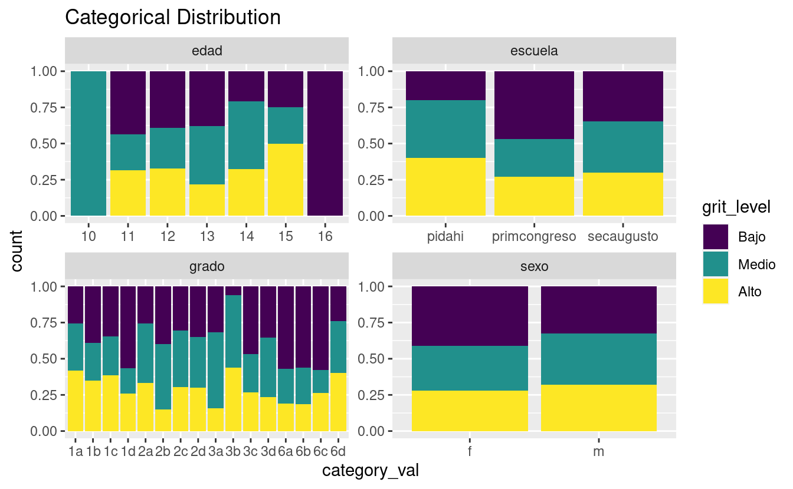

PROFILE - LEVELS
================

Results profiles and levels.

<pre class='chroma'><code class='language-r' data-lang='r'>#&gt;   grit_score_level as.numeric.rowSums.itemes_esfuerzo.._level
#&gt; 1            Medio                                       &lt;NA&gt;
#&gt; 2            Medio                                       &lt;NA&gt;
#&gt; 3            Medio                                       &lt;NA&gt;
#&gt; 4            Medio                                       &lt;NA&gt;
#&gt; 5            Medio                                       &lt;NA&gt;
#&gt; 6            Medio                                       &lt;NA&gt;
#&gt;   preocupacion_score_level
#&gt; 1                     &lt;NA&gt;
#&gt; 2                     &lt;NA&gt;
#&gt; 3                     &lt;NA&gt;
#&gt; 4                     &lt;NA&gt;
#&gt; 5                     &lt;NA&gt;
#&gt; 6                     &lt;NA&gt;</code></pre>

NUMERIC RESULTS
===============

MEANS AND LEVELS EMPF AND GRIT
------------------------------

<pre class='chroma'><code class='language-r' data-lang='r'>#&gt; [1] "==GRIT SD==:"#&gt;   grit_score as.numeric.rowSums.itemes_esfuerzo.. preocupacion_score
#&gt; 1    3.28125                                   51                 63
#&gt; 2    2.65625                                   44                 46
#&gt; 3    3.59375                                   52                 52
#&gt; 4    3.28125                                   40                 61
#&gt; 5    3.12500                                   45                 62
#&gt; 6    3.12500                                   45                 44#&gt;   grit_score_level as.numeric.rowSums.itemes_esfuerzo.._level
#&gt; 1            Medio                                       &lt;NA&gt;
#&gt; 2            Medio                                       &lt;NA&gt;
#&gt; 3            Medio                                       &lt;NA&gt;
#&gt; 4            Medio                                       &lt;NA&gt;
#&gt; 5            Medio                                       &lt;NA&gt;
#&gt; 6            Medio                                       &lt;NA&gt;
#&gt;   preocupacion_score_level
#&gt; 1                     &lt;NA&gt;
#&gt; 2                     &lt;NA&gt;
#&gt; 3                     &lt;NA&gt;
#&gt; 4                     &lt;NA&gt;
#&gt; 5                     &lt;NA&gt;
#&gt; 6                     &lt;NA&gt;</code></pre>

STACKED BARS FOR LEVELS OF EMPF AND GRIT
----------------------------------------

GRIT, ESFUERZO AND PREOCUPACION, PROPORTION VERSION.
----------------------------------------------------

BOXPLOTS GRIT
-------------

BOXPLOTS EMPF
-------------

