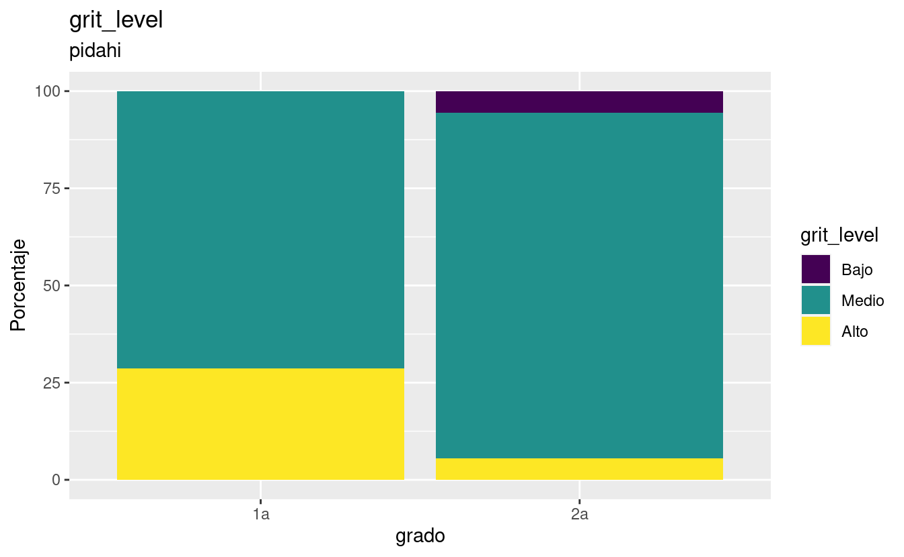

SCORE MEANS AND SD TABLES
=========================

These are the resulting tables containing the mean and sd for:

-   GRIT
-   Esfuerzo
-   Preocupacion

EXAMPLES OF HOW TO EXTRACT ITEMS FROM LISTS
-------------------------------------------

The levels percents tables are list of 3x3x2 with school names, level name and table/graph keys. The means table is a 3 items list with school name keys.

-   list\_by\_school\_levels\_percents\_tables\[\['secaugusto'\]\]\[\['preocupacion\_level'\]\]\[\['table'\]\]

-   list\_by\_school\_mean\_sd\_tables\[\['secaugusto'\]\]

PUBLICATION READY *OR BEAUTIFUL* TABLES
---------------------------------------

Tables with the default formatting for publication on scientific journals.

<pre class='chroma'><code class='language-r' data-lang='r'>#&gt; $pidahi
#&gt; 
#&gt; 
#&gt; |grado | grit_score_mean| grit_score_sd| esfuerzo_score_mean| esfuerzo_score_sd| preocupacion_score_mean| preocupacion_score_sd|
#&gt; |:-----|---------------:|-------------:|-------------------:|-----------------:|-----------------------:|---------------------:|
#&gt; |1a    |        3.437500|     0.5260159|            49.85714|         14.599413|                63.85714|              20.48112|
#&gt; |2a    |        3.142361|     0.4637877|            45.44444|          6.354454|                54.94444|              15.06251|
#&gt; 
#&gt; $primcongreso
#&gt; 
#&gt; 
#&gt; |grado | grit_score_mean| grit_score_sd| esfuerzo_score_mean| esfuerzo_score_sd| preocupacion_score_mean| preocupacion_score_sd|
#&gt; |:-----|---------------:|-------------:|-------------------:|-----------------:|-----------------------:|---------------------:|
#&gt; |6a    |        2.738095|     0.5775315|            43.38095|          6.414641|                57.85714|              13.31272|
#&gt; |6b    |        2.968750|     0.4704829|            46.37500|          7.228416|                58.50000|              11.97776|
#&gt; |6c    |        2.656250|     0.7141307|            44.05263|         10.590739|                60.89474|              20.04687|
#&gt; |6d    |        3.225000|     0.5667519|            46.44000|          8.386895|                63.76000|              19.87519|
#&gt; 
#&gt; $secaugusto
#&gt; 
#&gt; 
#&gt; |grado | grit_score_mean| grit_score_sd| esfuerzo_score_mean| esfuerzo_score_sd| preocupacion_score_mean| preocupacion_score_sd|
#&gt; |:-----|---------------:|-------------:|-------------------:|-----------------:|-----------------------:|---------------------:|
#&gt; |1a    |        3.177083|     0.6158754|            48.91667|          6.870964|                66.70833|              17.07905|
#&gt; |1b    |        3.036685|     0.6490851|            45.73913|          5.682648|                65.26087|              14.52965|
#&gt; |1c    |        3.329327|     0.7790835|            45.96154|         10.648871|                63.19231|              16.12456|
#&gt; |1d    |        2.887228|     0.8048558|            46.13043|          7.545645|                59.69565|              11.29938|
#&gt; |2a    |        3.311012|     0.6713644|            50.23810|          7.210442|                66.28571|              14.28336|
#&gt; |2b    |        2.906250|     0.6480138|            43.00000|          7.511395|                56.50000|              13.74007|
#&gt; |2c    |        3.097826|     0.5131703|            44.56522|          6.028916|                59.43478|              10.87460|
#&gt; |2d    |        3.031250|     0.7283046|            44.60000|          7.775806|                60.70000|              13.52230|
#&gt; |3a    |        3.018092|     0.4481971|            42.68421|         10.203772|                61.57895|              18.52421|
#&gt; |3b    |        3.349609|     0.6428917|            50.31250|          6.446898|                64.43750|              15.17440|
#&gt; |3c    |        3.125000|     0.4574532|            46.46667|          5.370111|                64.53333|              13.30879|
#&gt; |3d    |        3.115809|     0.6088504|            48.00000|          7.322909|                63.41176|              13.77978|</code></pre>

PROFILE LEVELS
==============

Results profiles and levels.

TABLES BY SCHOOLS. RAW VERSION
------------------------------

These are the tables containting the percentages of subjects under each level.

<pre class='chroma'><code class='language-r' data-lang='r'>#&gt; $pidahi
#&gt; $pidahi$grit_level
#&gt; $pidahi$grit_level$table
#&gt; 
#&gt; 
#&gt; |grado |    Medio|      Alto|     Bajo|
#&gt; |:-----|--------:|---------:|--------:|
#&gt; |1a    | 71.42857| 28.571429|       NA|
#&gt; |2a    | 88.88889|  5.555556| 5.555556|
#&gt; 
#&gt; $pidahi$grit_level$graph</code></pre>

<pre class='chroma'><code class='language-r' data-lang='r'>#&gt; 
#&gt; 
#&gt; $pidahi$esfuerzo_level
#&gt; $pidahi$esfuerzo_level$table
#&gt; 
#&gt; 
#&gt; |grado |     Bajo|     Alto| Superior|    Medio|
#&gt; |:-----|--------:|--------:|--------:|--------:|
#&gt; |1a    | 14.28571| 28.57143| 57.14286|       NA|
#&gt; |2a    |       NA| 61.11111| 33.33333| 5.555556|
#&gt; 
#&gt; $pidahi$esfuerzo_level$graph</code></pre>

<pre class='chroma'><code class='language-r' data-lang='r'>#&gt; 
#&gt; 
#&gt; $pidahi$preocupacion_level
#&gt; $pidahi$preocupacion_level$table
#&gt; 
#&gt; 
#&gt; |grado |     Bajo|    Medio|     Alto| Superior|
#&gt; |:-----|--------:|--------:|--------:|--------:|
#&gt; |1a    | 14.28571| 57.14286| 14.28571| 14.28571|
#&gt; |2a    | 16.66667| 61.11111| 22.22222|       NA|
#&gt; 
#&gt; $pidahi$preocupacion_level$graph</code></pre>

<pre class='chroma'><code class='language-r' data-lang='r'>#&gt; 
#&gt; 
#&gt; 
#&gt; $primcongreso
#&gt; $primcongreso$grit_level
#&gt; $primcongreso$grit_level$table
#&gt; 
#&gt; 
#&gt; |grado |     Bajo|    Medio|  Alto|
#&gt; |:-----|--------:|--------:|-----:|
#&gt; |6a    | 33.33333| 66.66667|    NA|
#&gt; |6b    |  6.25000| 87.50000|  6.25|
#&gt; |6c    | 42.10526| 57.89474|    NA|
#&gt; |6d    |  8.00000| 80.00000| 12.00|
#&gt; 
#&gt; $primcongreso$grit_level$graph</code></pre>

<pre class='chroma'><code class='language-r' data-lang='r'>#&gt; 
#&gt; 
#&gt; $primcongreso$esfuerzo_level
#&gt; $primcongreso$esfuerzo_level$table
#&gt; 
#&gt; 
#&gt; |grado |    Medio|     Alto| Superior|     Bajo|
#&gt; |:-----|--------:|--------:|--------:|--------:|
#&gt; |6a    | 23.80952| 57.14286| 19.04762|       NA|
#&gt; |6b    | 12.50000| 50.00000| 37.50000|       NA|
#&gt; |6c    | 15.78947| 42.10526| 36.84211| 5.263158|
#&gt; |6d    |  8.00000| 64.00000| 24.00000| 4.000000|
#&gt; 
#&gt; $primcongreso$esfuerzo_level$graph</code></pre>

<pre class='chroma'><code class='language-r' data-lang='r'>#&gt; 
#&gt; 
#&gt; $primcongreso$preocupacion_level
#&gt; $primcongreso$preocupacion_level$table
#&gt; 
#&gt; 
#&gt; |grado |     Bajo|    Medio|     Alto| Superior|
#&gt; |:-----|--------:|--------:|--------:|--------:|
#&gt; |6a    | 14.28571| 66.66667| 19.04762|       NA|
#&gt; |6b    |  6.25000| 75.00000| 12.50000|  6.25000|
#&gt; |6c    | 15.78947| 42.10526| 31.57895| 10.52632|
#&gt; |6d    |  8.00000| 44.00000| 40.00000|  8.00000|
#&gt; 
#&gt; $primcongreso$preocupacion_level$graph</code></pre>

<pre class='chroma'><code class='language-r' data-lang='r'>#&gt; 
#&gt; 
#&gt; 
#&gt; $secaugusto
#&gt; $secaugusto$grit_level
#&gt; $secaugusto$grit_level$table
#&gt; 
#&gt; 
#&gt; |grado |      Bajo|    Medio|      Alto|
#&gt; |:-----|---------:|--------:|---------:|
#&gt; |1a    | 12.500000| 70.83333| 16.666667|
#&gt; |1b    | 17.391304| 78.26087|  4.347826|
#&gt; |1c    | 11.538462| 65.38462| 23.076923|
#&gt; |1d    | 26.086956| 60.86957| 13.043478|
#&gt; |2a    |        NA| 80.95238| 19.047619|
#&gt; |2b    | 25.000000| 70.00000|  5.000000|
#&gt; |2c    |  8.695652| 82.60870|  8.695652|
#&gt; |2d    | 15.000000| 70.00000| 15.000000|
#&gt; |3a    | 10.526316| 84.21053|  5.263158|
#&gt; |3b    |  6.250000| 75.00000| 18.750000|
#&gt; |3c    |        NA| 86.66667| 13.333333|
#&gt; |3d    | 11.764706| 76.47059| 11.764706|
#&gt; 
#&gt; $secaugusto$grit_level$graph</code></pre>

<pre class='chroma'><code class='language-r' data-lang='r'>#&gt; 
#&gt; 
#&gt; $secaugusto$esfuerzo_level
#&gt; $secaugusto$esfuerzo_level$table
#&gt; 
#&gt; 
#&gt; |grado |     Medio|     Alto| Superior|     Bajo|
#&gt; |:-----|---------:|--------:|--------:|--------:|
#&gt; |1a    |  8.333333| 45.83333| 45.83333|       NA|
#&gt; |1b    | 13.043478| 73.91304| 13.04348|       NA|
#&gt; |1c    |  7.692308| 50.00000| 34.61538| 7.692308|
#&gt; |1d    | 17.391304| 52.17391| 30.43478|       NA|
#&gt; |2a    |        NA| 42.85714| 57.14286|       NA|
#&gt; |2b    | 25.000000| 55.00000| 20.00000|       NA|
#&gt; |2c    | 17.391304| 60.86957| 21.73913|       NA|
#&gt; |2d    | 20.000000| 60.00000| 20.00000|       NA|
#&gt; |3a    | 10.526316| 68.42105| 15.78947| 5.263158|
#&gt; |3b    |        NA| 62.50000| 37.50000|       NA|
#&gt; |3c    |  6.666667| 73.33333| 20.00000|       NA|
#&gt; |3d    | 11.764706| 52.94118| 35.29412|       NA|
#&gt; 
#&gt; $secaugusto$esfuerzo_level$graph</code></pre>

<pre class='chroma'><code class='language-r' data-lang='r'>#&gt; 
#&gt; 
#&gt; $secaugusto$preocupacion_level
#&gt; $secaugusto$preocupacion_level$table
#&gt; 
#&gt; 
#&gt; |grado |      Bajo|    Medio|     Alto|  Superior|
#&gt; |:-----|---------:|--------:|--------:|---------:|
#&gt; |1a    |  4.166667| 50.00000| 37.50000|  8.333333|
#&gt; |1b    |        NA| 60.86957| 30.43478|  8.695652|
#&gt; |1c    |  3.846154| 57.69231| 30.76923|  7.692308|
#&gt; |1d    | 13.043478| 60.86957| 26.08696|        NA|
#&gt; |2a    |  4.761905| 42.85714| 42.85714|  9.523810|
#&gt; |2b    | 10.000000| 75.00000| 15.00000|        NA|
#&gt; |2c    |  8.695652| 73.91304| 17.39130|        NA|
#&gt; |2d    |  5.000000| 55.00000| 40.00000|        NA|
#&gt; |3a    | 10.526316| 57.89474| 15.78947| 15.789474|
#&gt; |3b    | 12.500000| 37.50000| 43.75000|  6.250000|
#&gt; |3c    |  6.666667| 53.33333| 33.33333|  6.666667|
#&gt; |3d    |  5.882353| 47.05882| 47.05882|        NA|
#&gt; 
#&gt; $secaugusto$preocupacion_level$graph</code></pre>

<pre class='chroma'><code class='language-r' data-lang='r'>

</code></pre>

NUMERIC RESULTS
===============

MEANS AND LEVELS EMPF AND GRIT
------------------------------

<pre class='chroma'><code class='language-r' data-lang='r'>#&gt; [1] "==GRIT SD==:"#&gt;   grit_score esfuerzo_score preocupacion_score
#&gt; 1    3.28125             51                 63
#&gt; 2    2.65625             44                 46
#&gt; 3    3.59375             52                 52
#&gt; 4    3.28125             40                 61
#&gt; 5    3.12500             45                 62
#&gt; 6    3.12500             45                 44#&gt;   grit_level esfuerzo_level preocupacion_level
#&gt; 1      Medio       Superior              Medio
#&gt; 2      Medio           Alto              Medio
#&gt; 3      Medio       Superior              Medio
#&gt; 4      Medio           Alto              Medio
#&gt; 5      Medio           Alto              Medio
#&gt; 6      Medio           Alto              Medio</code></pre>

STACKED BARS FOR LEVELS OF EMPF AND GRIT
----------------------------------------

GRIT, ESFUERZO AND PREOCUPACION, PROPORTION VERSION.
----------------------------------------------------

BOXPLOTS GRIT
-------------

BOXPLOTS EMPF
-------------

