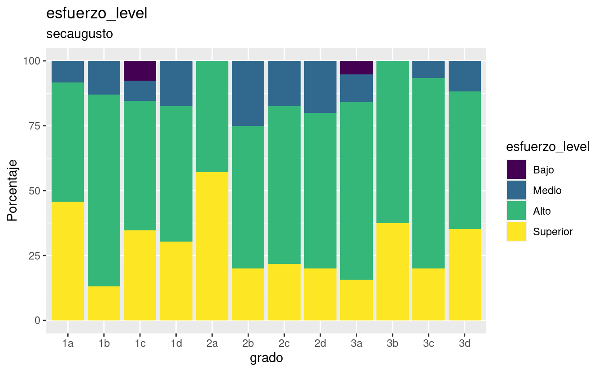
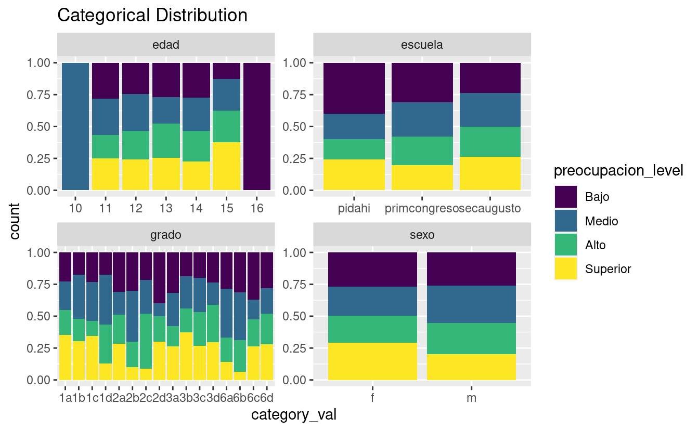

SCORE MEANS AND SD TABLES
=========================

These are the resulting tables containing the mean and sd for:

-   GRIT
-   Esfuerzo
-   Preocupacion

EXAMPLES OF HOW TO EXTRACT ITEMS FROM LISTS
-------------------------------------------

-   list\_by\_school\_levels\_percents\_tables\[\['secaugusto'\]\]\[\[3\]\]\[\['table'\]\]

-   list\_by\_school\_mean\_sd\_tables\[\['secaugusto'\]\]

<pre class='chroma'><code class='language-r' data-lang='r'>#&gt; $pidahi
#&gt; # A tibble: 3 × 4
#&gt;   grado grit_score_Prom esfuerzo_score_Prom preocupacion_score_Prom
#&gt;   &lt;fct&gt;           &lt;dbl&gt;               &lt;dbl&gt;                   &lt;dbl&gt;
#&gt; 1 1a               3.44                49.9                    63.9
#&gt; 2 2                3.44                52                      36  
#&gt; 3 2a               3.12                45.1                    56.1
#&gt; 
#&gt; $primcongreso
#&gt; # A tibble: 4 × 4
#&gt;   grado grit_score_Prom esfuerzo_score_Prom preocupacion_score_Prom
#&gt;   &lt;fct&gt;           &lt;dbl&gt;               &lt;dbl&gt;                   &lt;dbl&gt;
#&gt; 1 6a               2.74                43.4                    57.9
#&gt; 2 6b               2.97                46.4                    58.5
#&gt; 3 6c               2.66                44.1                    60.9
#&gt; 4 6d               3.22                46.4                    63.8
#&gt; 
#&gt; $secaugusto
#&gt; # A tibble: 12 × 4
#&gt;    grado grit_score_Prom esfuerzo_score_Prom preocupacion_score_Prom
#&gt;    &lt;fct&gt;           &lt;dbl&gt;               &lt;dbl&gt;                   &lt;dbl&gt;
#&gt;  1 1a               3.18                48.9                    66.7
#&gt;  2 1b               3.04                45.7                    65.3
#&gt;  3 1c               3.33                46.0                    63.2
#&gt;  4 1d               2.89                46.1                    59.7
#&gt;  5 2a               3.31                50.2                    66.3
#&gt;  6 2b               2.91                43                      56.5
#&gt;  7 2c               3.10                44.6                    59.4
#&gt;  8 2d               3.03                44.6                    60.7
#&gt;  9 3a               3.02                42.7                    61.6
#&gt; 10 3b               3.35                50.3                    64.4
#&gt; 11 3c               3.12                46.5                    64.5
#&gt; 12 3d               3.12                48                      63.4</code></pre>

PROFILE LEVELS
==============

Results profiles and levels.

TABLES BY SCHOOLS. RAW VERSION
------------------------------

These are the tables containting the percentages of subjects under each level.

<pre class='chroma'><code class='language-r' data-lang='r'>#&gt; $pidahi
#&gt; $pidahi[[1]]
#&gt; $pidahi[[1]]$table
#&gt; # A tibble: 3 × 4
#&gt;   grado Medio  Alto  Bajo
#&gt;   &lt;fct&gt; &lt;dbl&gt; &lt;dbl&gt; &lt;dbl&gt;
#&gt; 1 1a     71.4 28.6  NA   
#&gt; 2 2     100   NA    NA   
#&gt; 3 2a     88.2  5.88  5.88
#&gt; 
#&gt; $pidahi[[1]]$graph</code></pre>

<pre class='chroma'><code class='language-r' data-lang='r'>#&gt; 
#&gt; 
#&gt; $pidahi[[2]]
#&gt; $pidahi[[2]]$table
#&gt; # A tibble: 3 × 5
#&gt;   grado  Bajo  Alto Superior Medio
#&gt;   &lt;fct&gt; &lt;dbl&gt; &lt;dbl&gt;    &lt;dbl&gt; &lt;dbl&gt;
#&gt; 1 1a     14.3  28.6     57.1 NA   
#&gt; 2 2      NA    NA      100   NA   
#&gt; 3 2a     NA    64.7     29.4  5.88
#&gt; 
#&gt; $pidahi[[2]]$graph</code></pre>

<pre class='chroma'><code class='language-r' data-lang='r'>#&gt; 
#&gt; 
#&gt; $pidahi[[3]]
#&gt; $pidahi[[3]]$table
#&gt; # A tibble: 3 × 5
#&gt;   grado  Bajo Medio  Alto Superior
#&gt;   &lt;fct&gt; &lt;dbl&gt; &lt;dbl&gt; &lt;dbl&gt;    &lt;dbl&gt;
#&gt; 1 1a     14.3  57.1  14.3     14.3
#&gt; 2 2     100    NA    NA       NA  
#&gt; 3 2a     11.8  64.7  23.5     NA  
#&gt; 
#&gt; $pidahi[[3]]$graph</code></pre>

<pre class='chroma'><code class='language-r' data-lang='r'>#&gt; 
#&gt; 
#&gt; 
#&gt; $primcongreso
#&gt; $primcongreso[[1]]
#&gt; $primcongreso[[1]]$table
#&gt; # A tibble: 4 × 4
#&gt;   grado  Bajo Medio  Alto
#&gt;   &lt;fct&gt; &lt;dbl&gt; &lt;dbl&gt; &lt;dbl&gt;
#&gt; 1 6a    33.3   66.7 NA   
#&gt; 2 6b     6.25  87.5  6.25
#&gt; 3 6c    42.1   57.9 NA   
#&gt; 4 6d     8     80   12   
#&gt; 
#&gt; $primcongreso[[1]]$graph</code></pre>

<pre class='chroma'><code class='language-r' data-lang='r'>#&gt; 
#&gt; 
#&gt; $primcongreso[[2]]
#&gt; $primcongreso[[2]]$table
#&gt; # A tibble: 4 × 5
#&gt;   grado Medio  Alto Superior  Bajo
#&gt;   &lt;fct&gt; &lt;dbl&gt; &lt;dbl&gt;    &lt;dbl&gt; &lt;dbl&gt;
#&gt; 1 6a     23.8  57.1     19.0 NA   
#&gt; 2 6b     12.5  50       37.5 NA   
#&gt; 3 6c     15.8  42.1     36.8  5.26
#&gt; 4 6d      8    64       24    4   
#&gt; 
#&gt; $primcongreso[[2]]$graph</code></pre>

<pre class='chroma'><code class='language-r' data-lang='r'>#&gt; 
#&gt; 
#&gt; $primcongreso[[3]]
#&gt; $primcongreso[[3]]$table
#&gt; # A tibble: 4 × 5
#&gt;   grado  Bajo Medio  Alto Superior
#&gt;   &lt;fct&gt; &lt;dbl&gt; &lt;dbl&gt; &lt;dbl&gt;    &lt;dbl&gt;
#&gt; 1 6a    14.3   66.7  19.0    NA   
#&gt; 2 6b     6.25  75    12.5     6.25
#&gt; 3 6c    15.8   42.1  31.6    10.5 
#&gt; 4 6d     8     44    40       8   
#&gt; 
#&gt; $primcongreso[[3]]$graph</code></pre>

<pre class='chroma'><code class='language-r' data-lang='r'>#&gt; 
#&gt; 
#&gt; 
#&gt; $secaugusto
#&gt; $secaugusto[[1]]
#&gt; $secaugusto[[1]]$table
#&gt; # A tibble: 12 × 4
#&gt;    grado  Bajo Medio  Alto
#&gt;    &lt;fct&gt; &lt;dbl&gt; &lt;dbl&gt; &lt;dbl&gt;
#&gt;  1 1a    12.5   70.8 16.7 
#&gt;  2 1b    17.4   78.3  4.35
#&gt;  3 1c    11.5   65.4 23.1 
#&gt;  4 1d    26.1   60.9 13.0 
#&gt;  5 2a    NA     81.0 19.0 
#&gt;  6 2b    25     70    5   
#&gt;  7 2c     8.70  82.6  8.70
#&gt;  8 2d    15     70   15   
#&gt;  9 3a    10.5   84.2  5.26
#&gt; 10 3b     6.25  75   18.8 
#&gt; 11 3c    NA     86.7 13.3 
#&gt; 12 3d    11.8   76.5 11.8 
#&gt; 
#&gt; $secaugusto[[1]]$graph</code></pre>

<pre class='chroma'><code class='language-r' data-lang='r'>#&gt; 
#&gt; 
#&gt; $secaugusto[[2]]
#&gt; $secaugusto[[2]]$table
#&gt; # A tibble: 12 × 5
#&gt;    grado Medio  Alto Superior  Bajo
#&gt;    &lt;fct&gt; &lt;dbl&gt; &lt;dbl&gt;    &lt;dbl&gt; &lt;dbl&gt;
#&gt;  1 1a     8.33  45.8     45.8 NA   
#&gt;  2 1b    13.0   73.9     13.0 NA   
#&gt;  3 1c     7.69  50       34.6  7.69
#&gt;  4 1d    17.4   52.2     30.4 NA   
#&gt;  5 2a    NA     42.9     57.1 NA   
#&gt;  6 2b    25     55       20   NA   
#&gt;  7 2c    17.4   60.9     21.7 NA   
#&gt;  8 2d    20     60       20   NA   
#&gt;  9 3a    10.5   68.4     15.8  5.26
#&gt; 10 3b    NA     62.5     37.5 NA   
#&gt; 11 3c     6.67  73.3     20   NA   
#&gt; 12 3d    11.8   52.9     35.3 NA   
#&gt; 
#&gt; $secaugusto[[2]]$graph</code></pre>

<pre class='chroma'><code class='language-r' data-lang='r'>#&gt; 
#&gt; 
#&gt; $secaugusto[[3]]
#&gt; $secaugusto[[3]]$table
#&gt; # A tibble: 12 × 5
#&gt;    grado  Bajo Medio  Alto Superior
#&gt;    &lt;fct&gt; &lt;dbl&gt; &lt;dbl&gt; &lt;dbl&gt;    &lt;dbl&gt;
#&gt;  1 1a     4.17  50    37.5     8.33
#&gt;  2 1b    NA     60.9  30.4     8.70
#&gt;  3 1c     3.85  57.7  30.8     7.69
#&gt;  4 1d    13.0   60.9  26.1    NA   
#&gt;  5 2a     4.76  42.9  42.9     9.52
#&gt;  6 2b    10     75    15      NA   
#&gt;  7 2c     8.70  73.9  17.4    NA   
#&gt;  8 2d     5     55    40      NA   
#&gt;  9 3a    10.5   57.9  15.8    15.8 
#&gt; 10 3b    12.5   37.5  43.8     6.25
#&gt; 11 3c     6.67  53.3  33.3     6.67
#&gt; 12 3d     5.88  47.1  47.1    NA   
#&gt; 
#&gt; $secaugusto[[3]]$graph</code></pre>

<pre class='chroma'><code class='language-r' data-lang='r'>

</code></pre>

NUMERIC RESULTS
===============

MEANS AND LEVELS EMPF AND GRIT
------------------------------

<pre class='chroma'><code class='language-r' data-lang='r'>#&gt; [1] "==GRIT SD==:"#&gt;   grit_score esfuerzo_score preocupacion_score
#&gt; 1    3.28125             51                 63
#&gt; 2    2.65625             44                 46
#&gt; 3    3.59375             52                 52
#&gt; 4    3.28125             40                 61
#&gt; 5    3.12500             45                 62
#&gt; 6    3.12500             45                 44#&gt;   grit_level esfuerzo_level preocupacion_level
#&gt; 1      Medio       Superior              Medio
#&gt; 2      Medio           Alto              Medio
#&gt; 3      Medio       Superior              Medio
#&gt; 4      Medio           Alto              Medio
#&gt; 5      Medio           Alto              Medio
#&gt; 6      Medio           Alto              Medio</code></pre>

STACKED BARS FOR LEVELS OF EMPF AND GRIT
----------------------------------------

GRIT, ESFUERZO AND PREOCUPACION, PROPORTION VERSION.
----------------------------------------------------

BOXPLOTS GRIT
-------------

BOXPLOTS EMPF
-------------

