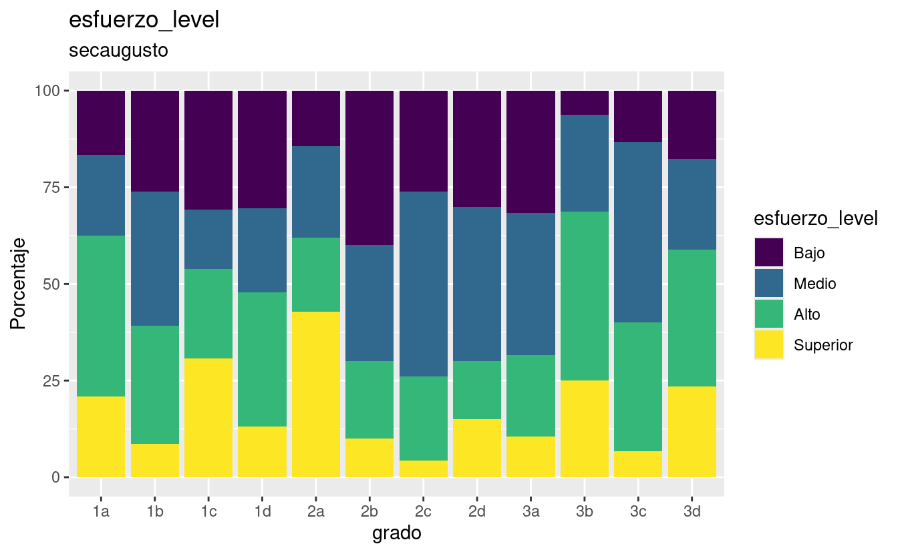
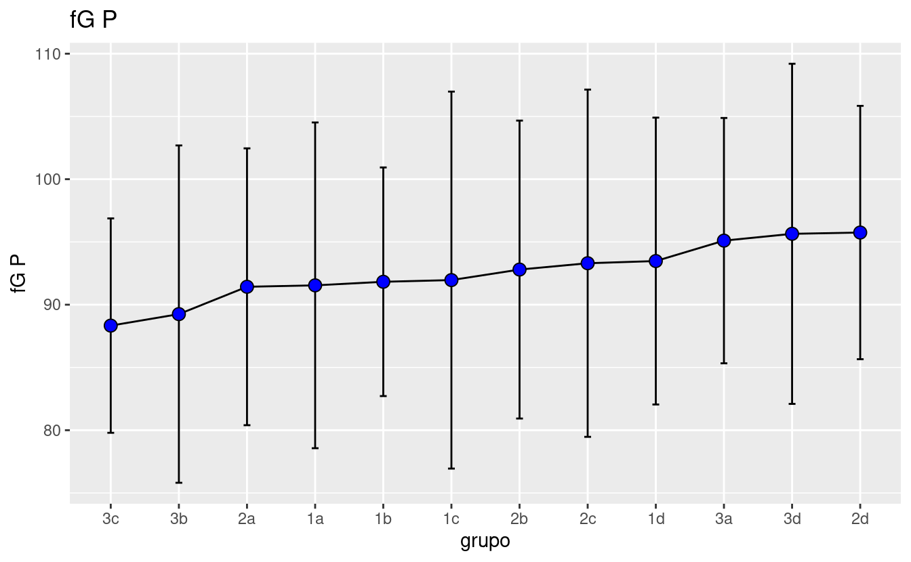

# USAGE DOCUMENTATION

## TABLES EXAMPLES

To show a level-percentage table by school:

The elements of the list

-   First element:

\[1\] "andes" "bicentenario" "cepac" "coltec"

\[5\] "diosa" "esperanza" "pidahi" "primcongreso"

\[9\] "secaugusto" "villavicencio"

-   Second element:

\[1\] "fG_level" "tenacidad_level" "esfuerzo_level"

\[4\] "preocupacion_level"

### Table Augusto Intelligence

-   Use "caption" field to modify the title.

| grado | medio | medio-alto | alto | bajo |
|:------|------:|-----------:|-----:|-----:|
| 1a    |  71.4 |       14.3 | 14.3 |   NA |
| 2a    |  16.7 |       33.3 | 44.4 |  5.6 |

Nivel de Inteligencia

### Table Augusto Tenacidad

-   Use "caption" field to modify the title.

| grado | Bajo | Medio | Alto |
|:------|-----:|------:|-----:|
| 1a    | 14.3 |  28.6 | 57.1 |
| 2a    | 33.3 |  44.4 | 22.2 |

Nivel de Tenacidad

### Table Augusto Esfuerzo

-   Use "caption" field to modify the title.

| grado | Bajo | Alto | Superior | Medio |
|:------|-----:|-----:|---------:|------:|
| 1a    | 28.6 | 28.6 |     42.9 |    NA |
| 2a    | 27.8 | 44.4 |       NA |  27.8 |

Nivel de Esfuerzo

### Table Augusto Preocupacion

-   Use "caption" field to modify the title.

| grado | Bajo | Medio | Alto | Superior |
|:------|-----:|------:|-----:|---------:|
| 1a    | 28.6 |  28.6 | 14.3 |     28.6 |
| 2a    | 44.4 |  16.7 | 27.8 |     11.1 |

Nivel de Preocupacion

## Showing a mean-sd table by school

Note that there is only one mean-sd table by school

### Mean and Standard deviation Table for Augusto

-   Use "caption" field to modify the title.

| grado |  fG P | fG d | Tenacidad P | Tenacidad d | Esfuerzo P | Esfuerzo d | Preocupacion P | Preocupacion d |
|:-----|-----:|----:|---------:|---------:|--------:|--------:|-----------:|-----------:|
| 1a    | 103.7 |  7.7 |         3.4 |         0.5 |       49.9 |       14.6 |           63.9 |           20.5 |
| 2a    | 113.3 | 12.9 |         3.2 |         0.5 |       45.4 |        6.4 |           54.9 |           15.1 |

pidahi

## GRAPHICS EXAMPLES

Showing a level-percentage graphic:

Use the same elements as the level-percent table, but set 'graph' in the last element.

### Percent-Levels Augusto Intelligence

### Percent-Levels Augusto Tenacity

### Percent-Levels Augusto Effort

### Percent-Levels Augusto Preoccupation

## MEAN AND SD GRAPHS

Showing a main-sd point inverval plot:

-   First element is school name same as examples above.

-   Second elemnt:

"fG" "Tenaci" "Esfuer" "Preocu"

### Example Augusto Intelligence

### Example Augusto Tenacidad

### Example Augusto Esfuerzo

### Example Augusto Preocupacion

# Mafer's REPORT

El presente informe es una síntesis de los hallazgos producto del análisis de las pruebas de perfeccionismo y tenacidad, aplicadas a los estudiantes de su institución de los grados 1° a 3°, quienes participaron en éste ejercicio, mediante el cual se busca brindarles información valiosa de los estudiantes, que sirvan de complemento a otras medidas y datos disponibles, favoreciendo el diseño e implementación de estrategias de orientación psicoeducativa. Es importante aclarar que se trata de resultados preliminares, dado que las pruebas se encuentran en proceso de validación. A continuación se presenta una breve información sobre las variables y las pruebas, con referencia a la población de la propia institución y con el fin de ayudarles en la interpretación de los datos: IMPORTANTE: Estos resultados deben ser usados únicamente en pro de los estudiantes y nunca con fines de discriminación ni diagnóstico.

