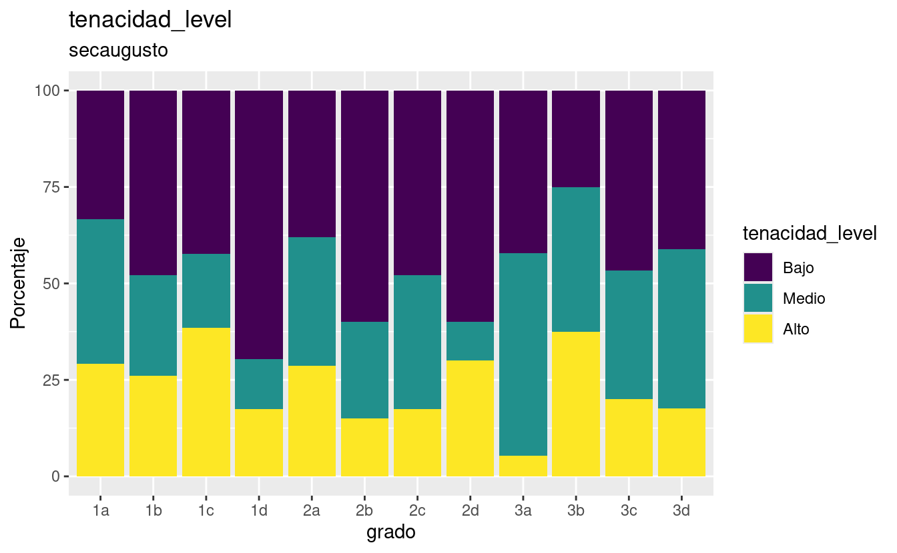

# USAGE DOCUMENTATION

## TABLES EXAMPLES

To show a level-percentage table by school:

The elements of the list

-   First element:

\[1\] "andes" "bicentenario" "cepac" "coltec"

\[5\] "diosa" "esperanza" "pidahi" "primcongreso"

\[9\] "secaugusto" "villavicencio"

-   Second element:

\[1\] "fG_level" "tenacidad_level" "esfuerzo_level"

\[4\] "preocupacion_level"

### Table Augusto Intelligence

-   Use "caption" field to modify the title.

| grado | bajo | medio-bajo | medio | medio-alto | alto | Muy_bajo | muy_alto |
|:------|-----:|-----------:|------:|-----------:|-----:|---------:|---------:|
| 6a    | 23.8 |       33.3 |  28.6 |        9.5 |  4.8 |       NA |       NA |
| 6b    |  6.2 |       18.8 |  68.8 |        6.2 |   NA |       NA |       NA |
| 6c    | 15.8 |       10.5 |  31.6 |       21.1 |  5.3 |     10.5 |      5.3 |
| 6d    | 20.0 |       24.0 |  32.0 |       16.0 |  8.0 |       NA |       NA |

Nivel de Inteligencia

### Table Augusto Tenacidad

-   Use "caption" field to modify the title.

| grado | Bajo | Medio | Alto |
|:------|-----:|------:|-----:|
| 6a    | 61.9 |  28.6 |  9.5 |
| 6b    | 56.2 |  31.2 | 12.5 |
| 6c    | 63.2 |  26.3 | 10.5 |
| 6d    | 40.0 |  32.0 | 28.0 |

Nivel de Tenacidad

### Table Augusto Esfuerzo

-   Use "caption" field to modify the title.

| grado | Bajo | Medio | Alto | Superior |
|:------|-----:|------:|-----:|---------:|
| 6a    | 38.1 |  38.1 | 14.3 |      9.5 |
| 6b    | 25.0 |  18.8 | 43.8 |     12.5 |
| 6c    | 42.1 |  10.5 | 31.6 |     15.8 |
| 6d    | 12.0 |  44.0 | 28.0 |     16.0 |

Nivel de Esfuerzo

### Table Augusto Preocupacion

-   Use "caption" field to modify the title.

| grado | Bajo | Medio | Alto | Superior |
|:------|-----:|------:|-----:|---------:|
| 6a    | 28.6 |  38.1 | 19.0 |     14.3 |
| 6b    | 25.0 |  43.8 | 25.0 |      6.2 |
| 6c    | 36.8 |  15.8 | 26.3 |     21.1 |
| 6d    | 28.0 |  20.0 | 28.0 |     24.0 |

Nivel de Preocupacion

## Showing a mean-sd table by school

Note that there is only one mean-sd table by school

### Mean and Standard deviation Table for Augusto

-   Use "caption" field to modify the title.

| grado | fG P | fG d | Tenacidad P | Tenacidad d | Esfuerzo P | Esfuerzo d | Preocupacion P | Preocupacion d |
|:-----|----:|----:|---------:|---------:|--------:|--------:|-----------:|-----------:|
| 6a    | 94.0 | 11.4 |         2.7 |         0.6 |       43.4 |        6.4 |           57.9 |           13.3 |
| 6b    | 97.2 |  7.5 |         3.0 |         0.5 |       46.4 |        7.2 |           58.5 |           12.0 |
| 6c    | 95.5 | 18.2 |         2.7 |         0.7 |       44.1 |       10.6 |           60.9 |           20.0 |
| 6d    | 96.9 | 12.7 |         3.2 |         0.6 |       46.4 |        8.4 |           63.8 |           19.9 |

primcongreso

## GRAPHICS EXAMPLES

Showing a level-percentage graphic:

Use the same elements as the level-percent table, but set 'graph' in the last element.

### Percent-Levels Augusto Intelligence

### Percent-Levels Augusto Tenacity

### Percent-Levels Augusto Effort

### Percent-Levels Augusto Preoccupation

## MEAN AND SD GRAPHS

Showing a main-sd point inverval plot:

-   First element is school name same as examples above.

-   Second elemnt:

"fG" "Tenaci" "Esfuer" "Preocu"

### Example Augusto Intelligence

### Example Augusto Tenacidad

### Example Augusto Esfuerzo

### Example Augusto Preocupacion

# Mafer's REPORT

El presente informe es una síntesis de los hallazgos producto del análisis de las pruebas de perfeccionismo y tenacidad, aplicadas a los estudiantes de su institución de los grados 1° a 3°, quienes participaron en éste ejercicio, mediante el cual se busca brindarles información valiosa de los estudiantes, que sirvan de complemento a otras medidas y datos disponibles, favoreciendo el diseño e implementación de estrategias de orientación psicoeducativa. Es importante aclarar que se trata de resultados preliminares, dado que las pruebas se encuentran en proceso de validación. A continuación se presenta una breve información sobre las variables y las pruebas, con referencia a la población de la propia institución y con el fin de ayudarles en la interpretación de los datos: IMPORTANTE: Estos resultados deben ser usados únicamente en pro de los estudiantes y nunca con fines de discriminación ni diagnóstico.

