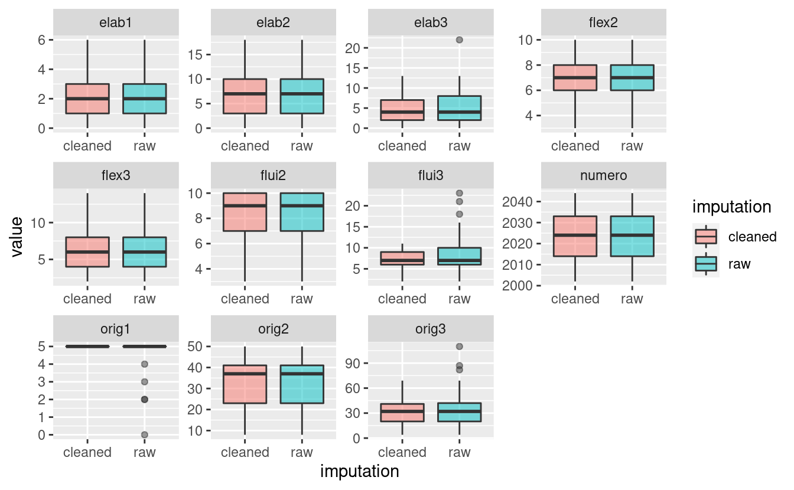

TORRANCE OUTLAIERS
==================

Shows raw and oulaiers-cleaned dataset for torrance test for each variable

Notas
-----

-   In scatterplos there seem to be a few extreme values

-   Cleaning changes the correlations

-   Valores cambian al quitar valores extremos (i.e., outlaiers)

-   Con extremos: mejores predictores son *actividad* y *sonrisa*

-   Sin extremos: *atencion* es el mejor predictor

