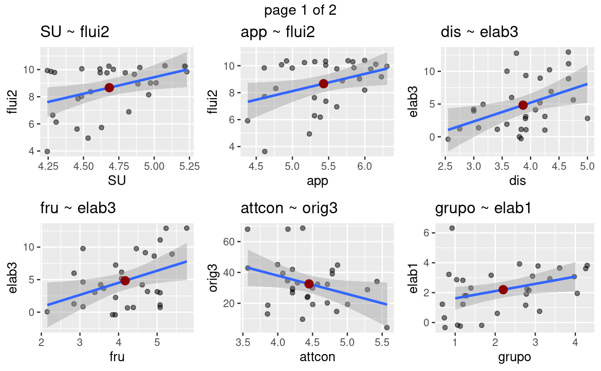
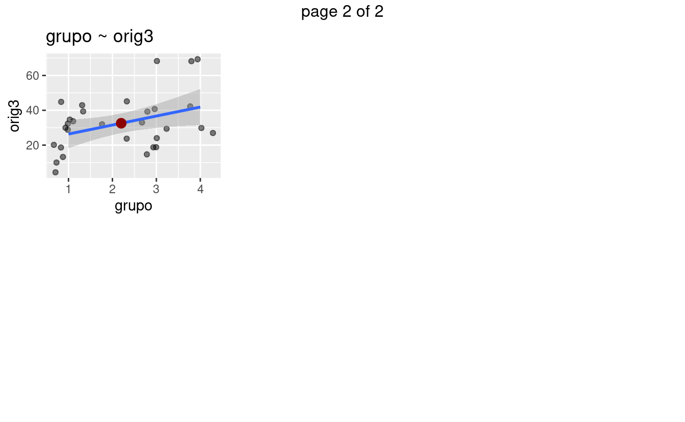
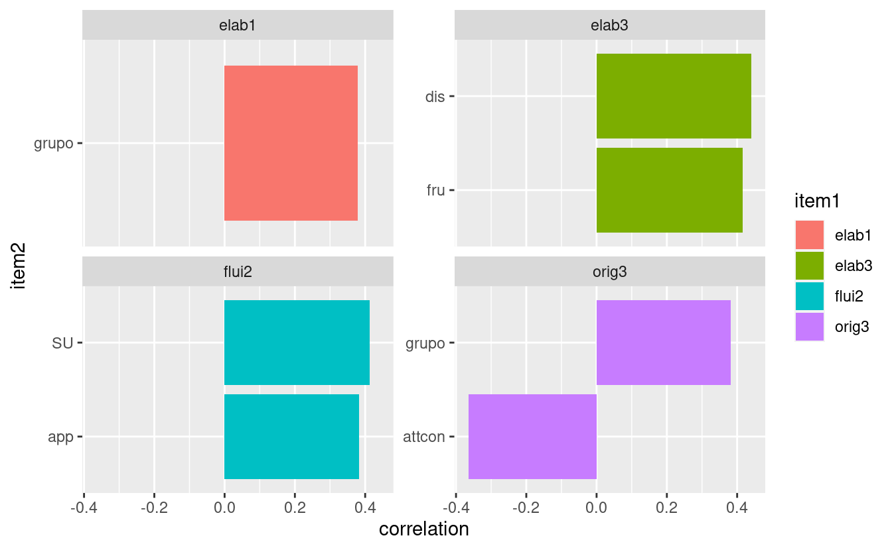
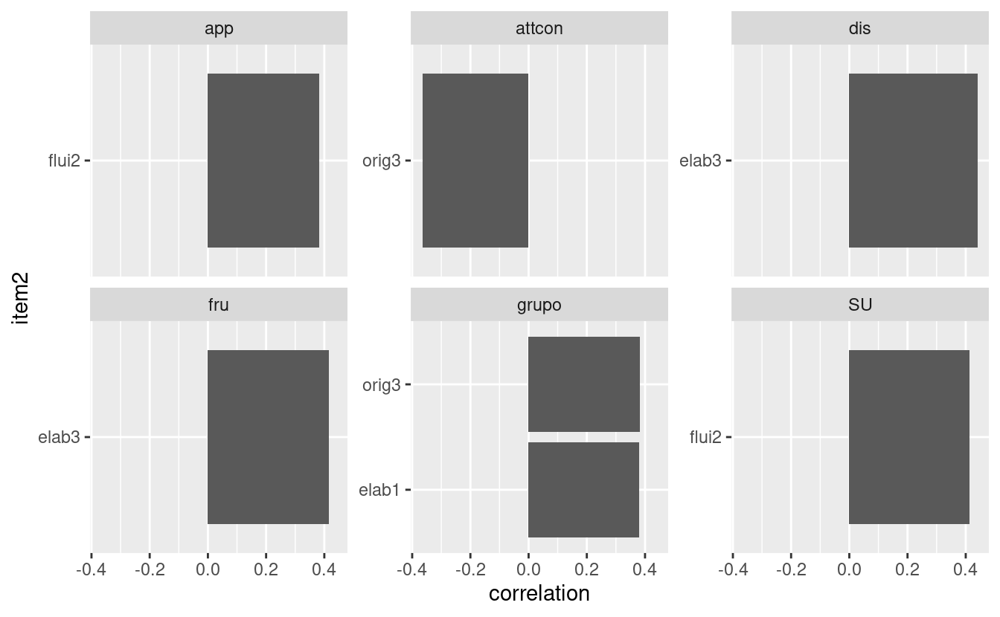

SCATTER PLOTS
=============

Correlation Matrix
==================

P-values Matrix
===============

<pre class='chroma'><code class='language-r' data-lang='r'>#&gt; [1] "flui2 SU"
#&gt; [1] "elab3 fru"
#&gt; [1] "flui2 app"
#&gt; [1] "orig3 attcon"
#&gt; [1] "elab3 dis"
#&gt; [1] "elab1 grupo"
#&gt; [1] "orig3 grupo"
#&gt;       CE AN        SU act       fru      app attfoc attshi     attcon       dis
#&gt; orig1 NA NA        NA  NA        NA       NA     NA     NA         NA        NA
#&gt; elab1 NA NA        NA  NA        NA       NA     NA     NA         NA        NA
#&gt; orig2 NA NA        NA  NA        NA       NA     NA     NA         NA        NA
#&gt; flui2 NA NA 0.4133396  NA        NA 0.382828     NA     NA         NA        NA
#&gt; elab2 NA NA        NA  NA        NA       NA     NA     NA         NA        NA
#&gt; flex2 NA NA        NA  NA        NA       NA     NA     NA         NA        NA
#&gt; orig3 NA NA        NA  NA        NA       NA     NA     NA -0.3645813        NA
#&gt; flui3 NA NA        NA  NA        NA       NA     NA     NA         NA        NA
#&gt; elab3 NA NA        NA  NA 0.4158596       NA     NA     NA         NA 0.4401565
#&gt; flex3 NA NA        NA  NA        NA       NA     NA     NA         NA        NA
#&gt;       sth fea hip imp inh lip per sad shy smi escuela     grupo edad sexo
#&gt; orig1  NA  NA  NA  NA  NA  NA  NA  NA  NA  NA      NA        NA   NA   NA
#&gt; elab1  NA  NA  NA  NA  NA  NA  NA  NA  NA  NA      NA 0.3792686   NA   NA
#&gt; orig2  NA  NA  NA  NA  NA  NA  NA  NA  NA  NA      NA        NA   NA   NA
#&gt; flui2  NA  NA  NA  NA  NA  NA  NA  NA  NA  NA      NA        NA   NA   NA
#&gt; elab2  NA  NA  NA  NA  NA  NA  NA  NA  NA  NA      NA        NA   NA   NA
#&gt; flex2  NA  NA  NA  NA  NA  NA  NA  NA  NA  NA      NA        NA   NA   NA
#&gt; orig3  NA  NA  NA  NA  NA  NA  NA  NA  NA  NA      NA 0.3819533   NA   NA
#&gt; flui3  NA  NA  NA  NA  NA  NA  NA  NA  NA  NA      NA        NA   NA   NA
#&gt; elab3  NA  NA  NA  NA  NA  NA  NA  NA  NA  NA      NA        NA   NA   NA
#&gt; flex3  NA  NA  NA  NA  NA  NA  NA  NA  NA  NA      NA        NA   NA   NA
#&gt;       percentil rango columna_a columna_ab columna_b puntaje
#&gt; orig1        NA    NA        NA         NA        NA      NA
#&gt; elab1        NA    NA        NA         NA        NA      NA
#&gt; orig2        NA    NA        NA         NA        NA      NA
#&gt; flui2        NA    NA        NA         NA        NA      NA
#&gt; elab2        NA    NA        NA         NA        NA      NA
#&gt; flex2        NA    NA        NA         NA        NA      NA
#&gt; orig3        NA    NA        NA         NA        NA      NA
#&gt; flui3        NA    NA        NA         NA        NA      NA
#&gt; elab3        NA    NA        NA         NA        NA      NA
#&gt; flex3        NA    NA        NA         NA        NA      NA</code></pre>

GRAPHICS
========

PAIRED CORRELATIONS
===================

Grouped by Torrance
-------------------

Grouped by Temperament, Raven and Other Variables
-------------------------------------------------

