# CORRELATION analyses

## Torrance CBQ

<pre class='chroma'><code class='language-r' data-lang='r'>#&gt; [1] "sum_fluidez CE _ r = -0.36436272 _ pval = 0.037"
#&gt; [1] "sum_creatividad CE _ r = -0.38411438 _ pval = 0.027"
#&gt; [1] "perc_elaboracion AN _ r = 0.36752833 _ pval = 0.035"
#&gt; [1] "sum_originalidad attfoc _ r = -0.38813585 _ pval = 0.026"
#&gt; [1] "sum_fluidez attfoc _ r = -0.35626748 _ pval = 0.042"
#&gt; [1] "sum_creatividad attfoc _ r = -0.36806898 _ pval = 0.035"
#&gt; [1] "perc_originalidad attfoc _ r = -0.39367786 _ pval = 0.023"
#&gt; [1] "perc_fluidez attfoc _ r = -0.39020321 _ pval = 0.025"
#&gt; [1] "perc_flexibilidad attfoc _ r = -0.37244346 _ pval = 0.033"
#&gt; [1] "perc_creatividad attfoc _ r = -0.38173323 _ pval = 0.028"
#&gt; [1] "sum_fluidez attshi _ r = -0.36702418 _ pval = 0.036"
#&gt; [1] "sum_flexibilidad attshi _ r = -0.37672693 _ pval = 0.031"
#&gt; [1] "sum_creatividad attshi _ r = -0.35249591 _ pval = 0.044"
#&gt; [1] "sum_originalidad attcon _ r = -0.41503347 _ pval = 0.016"
#&gt; [1] "sum_fluidez attcon _ r = -0.430861 _ pval = 0.012"
#&gt; [1] "sum_flexibilidad attcon _ r = -0.37492966 _ pval = 0.032"
#&gt; [1] "sum_creatividad attcon _ r = -0.43281009 _ pval = 0.012"
#&gt; [1] "perc_originalidad attcon _ r = -0.39803772 _ pval = 0.022"
#&gt; [1] "perc_fluidez attcon _ r = -0.41642031 _ pval = 0.016"
#&gt; [1] "perc_flexibilidad attcon _ r = -0.43095068 _ pval = 0.012"
#&gt; [1] "perc_creatividad attcon _ r = -0.41606685 _ pval = 0.016"
#&gt; [1] "perc_elaboracion dis _ r = 0.53383373 _ pval = 0.001"
#&gt; [1] "sum_flexibilidad sth _ r = -0.34645359 _ pval = 0.048"
#&gt; [1] "sum_fluidez fea _ r = 0.35963524 _ pval = 0.04"
#&gt; [1] "perc_elaboracion inh _ r = -0.37898954 _ pval = 0.03"
</code></pre>
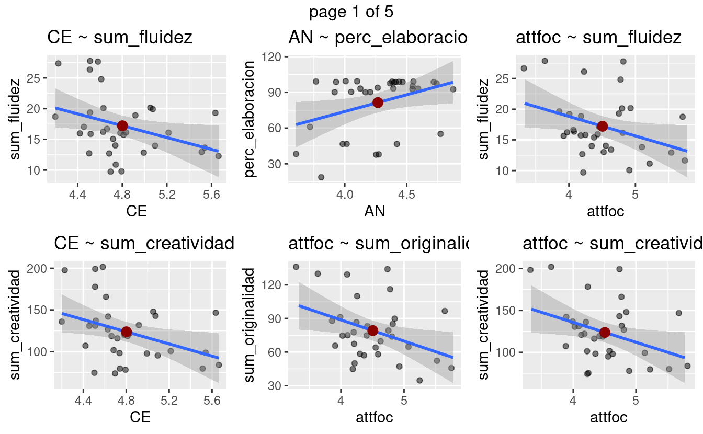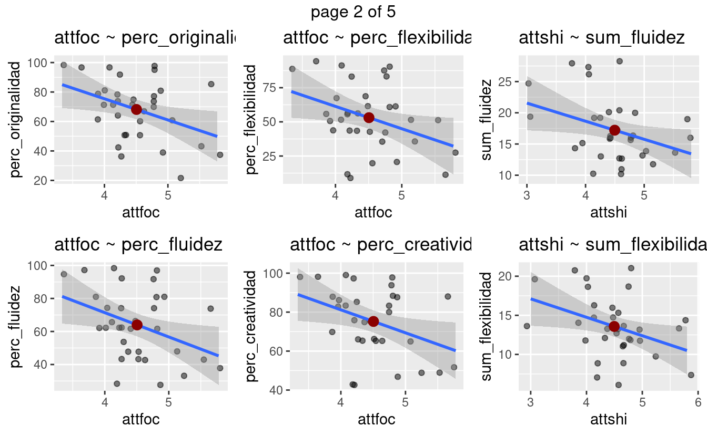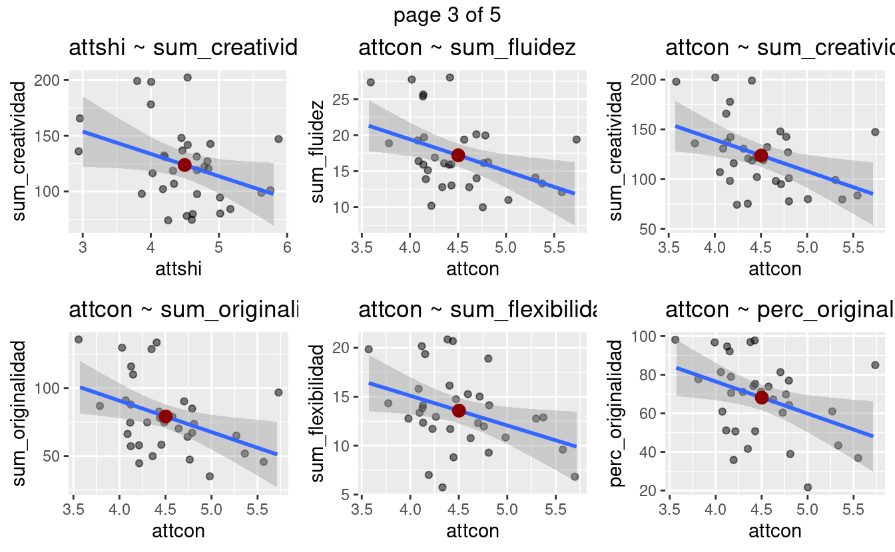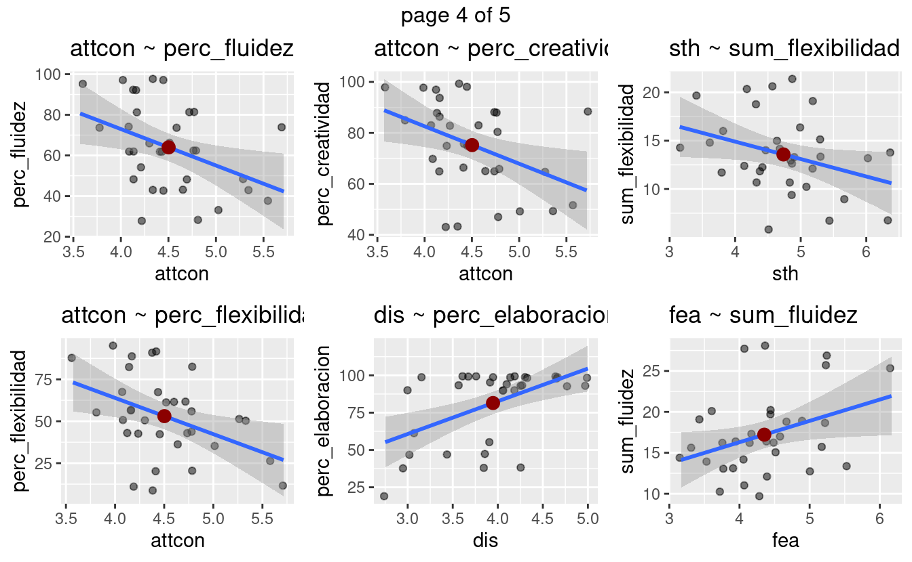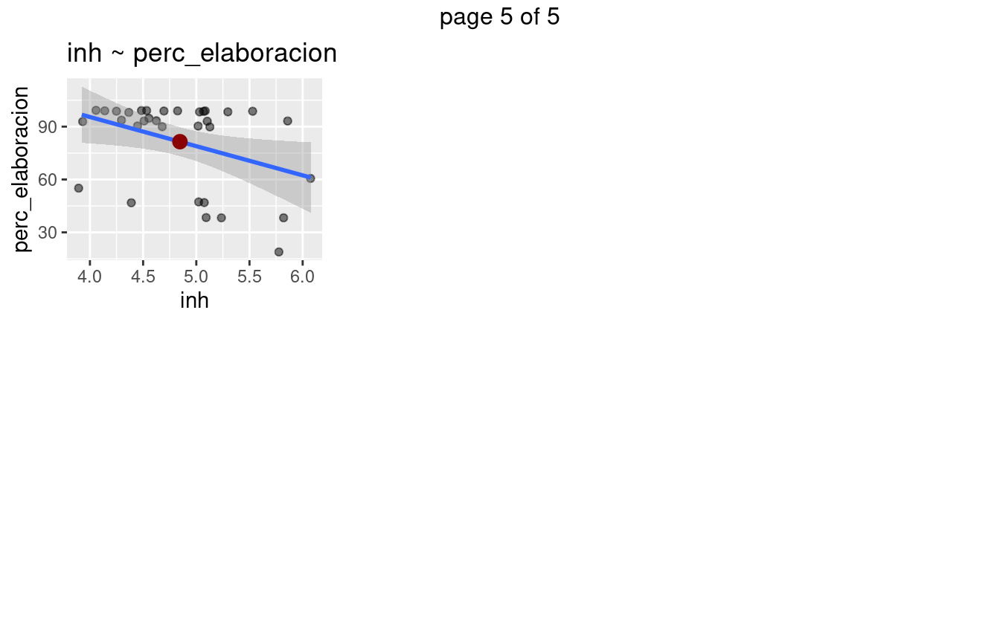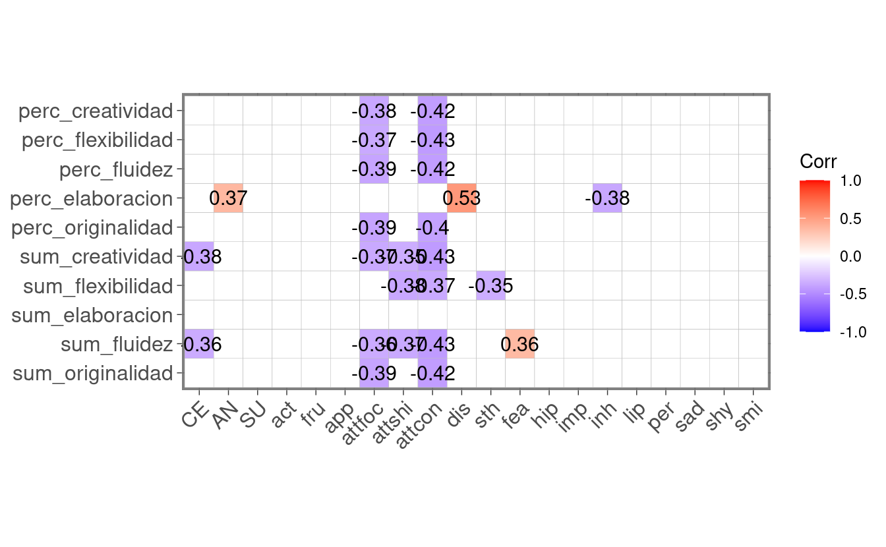

# Torrance - Raven Correlation Plots.

-   Raven iq test correlation to creativity torrce test.

-   Note 0.09 p-value (that is marginally significant) was used.

<pre class='chroma'><code class='language-r' data-lang='r'>#&gt; [1] "sum_creatividad percentil _ r = 0.26557038 _ pval = 0.093"
#&gt; [1] "sum_creatividad rango _ r = -0.27895575 _ pval = 0.077"
</code></pre>
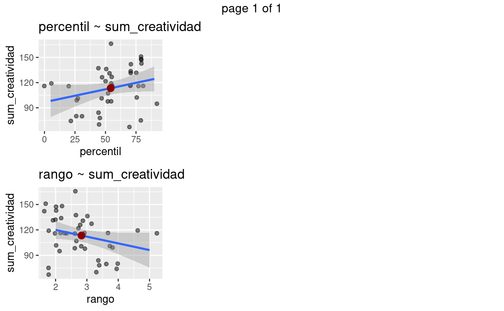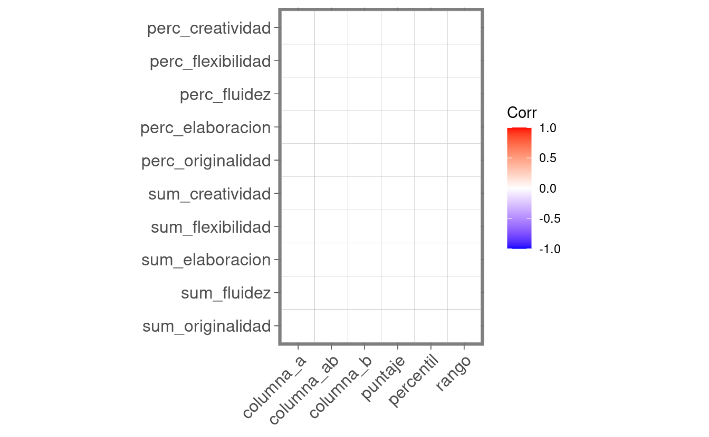

# Raven CBQ Corrlation Graphics

-   Also 0.09 p value.

<pre class='chroma'><code class='language-r' data-lang='r'>#&gt; [1] "percentil AN _ r = 0.31851113 _ pval = 0.062"
#&gt; [1] "rango AN _ r = -0.34230535 _ pval = 0.044"
#&gt; [1] "columna_b SU _ r = 0.36984687 _ pval = 0.029"
#&gt; [1] "columna_ab act _ r = 0.30533752 _ pval = 0.074"
#&gt; [1] "columna_b act _ r = 0.46120069 _ pval = 0.005"
#&gt; [1] "puntaje act _ r = 0.32638496 _ pval = 0.056"
#&gt; [1] "percentil act _ r = 0.29486108 _ pval = 0.086"
#&gt; [1] "percentil fru _ r = 0.37507121 _ pval = 0.026"
#&gt; [1] "rango fru _ r = -0.35421748 _ pval = 0.037"
#&gt; [1] "puntaje per _ r = 0.30610049 _ pval = 0.074"
#&gt; [1] "columna_b smi _ r = 0.37731623 _ pval = 0.025"
</code></pre>
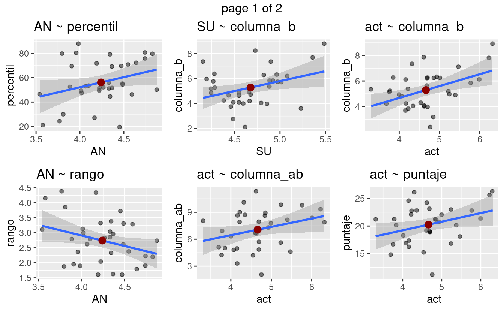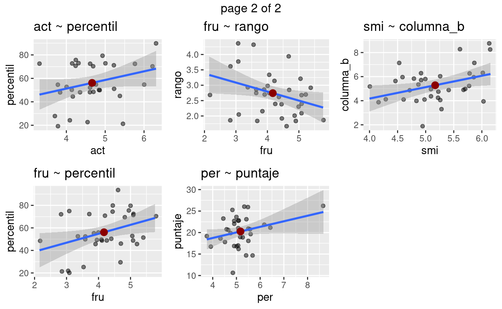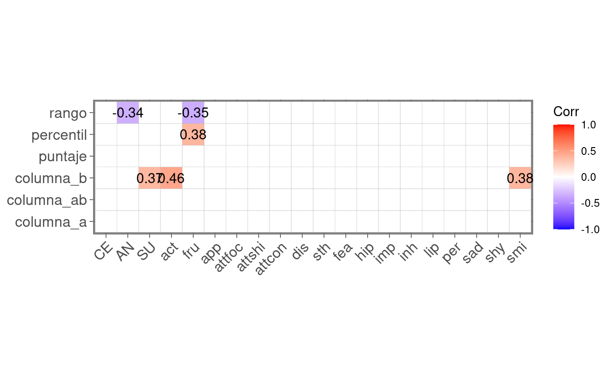

