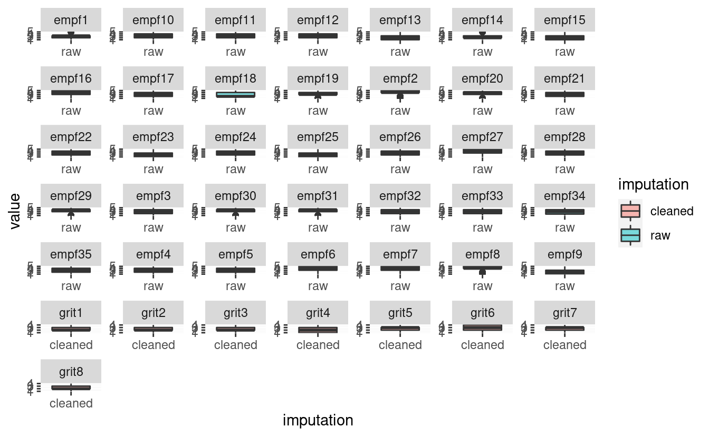

EMPF DESCRIPTIVE STATISTICS
===========================

Descriptivos empf.
------------------

GRIT DESCRIPTIVE STATISTICS
===========================

Descriptivos GRIT.
------------------

SE ANALIZARÁN ESTAS DOS PRUEBAS QUE YA ESTÁN VALIDADAS PARA LOS INFORMES: grit (va de grit1-grit8). RANGOS: BAJO (1 - 4.5), MEDIO (4.6 - 6.1) Y ALTO (6.2 -- 8.0) EMPF (EMPF1-EMPF35). RANGOS: BAJO (5 -- 17), MEDIO (18 -- 20), ALTO (21 -- 22) Y SUPERIOR (23 -- 25).

TORRANCE OUTLAIERS
==================

Shows raw and oulaiers-cleaned dataset for torrance test for each variable

Notas
-----

-   In scatterplos there seem to be a few extreme values

-   Cleaning changes the correlations

-   Valores cambian al quitar valores extremos (i.e., outlaiers)

-   Con extremos: mejores predictores son *actividad* y *sonrisa*

-   Sin extremos: *atencion* es el mejor predictor

