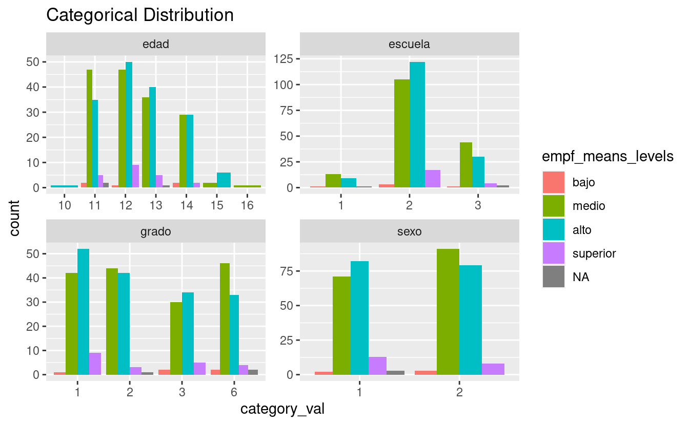
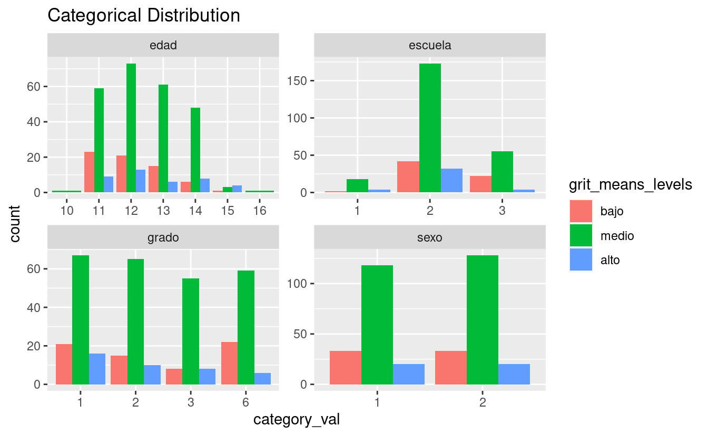
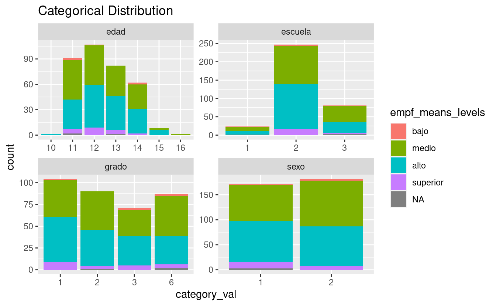

STACKED BARS FOR LEVELS OF EMPF AND GRIT
----------------------------------------

SE ANALIZARÁN ESTAS DOS PRUEBAS QUE YA ESTÁN VALIDADAS PARA LOS INFORMES: grit (va de grit1-grit8). RANGOS: BAJO (1 - 4.5), MEDIO (4.6 - 6.1) Y ALTO (6.2 -- 8.0) EMPF (EMPF1-EMPF35). RANGOS: BAJO (5 -- 17), MEDIO (18 -- 20), ALTO (21 -- 22) Y SUPERIOR (23 -- 25).

EMPF DESCRIPTIVE STATISTICS
===========================

Descriptivos empf.
------------------

GRIT DESCRIPTIVE STATISTICS
===========================

Descriptivos GRIT.
------------------

BOXPLOTS GRIT
-------------

BOXPLOTS EMPF
-------------

