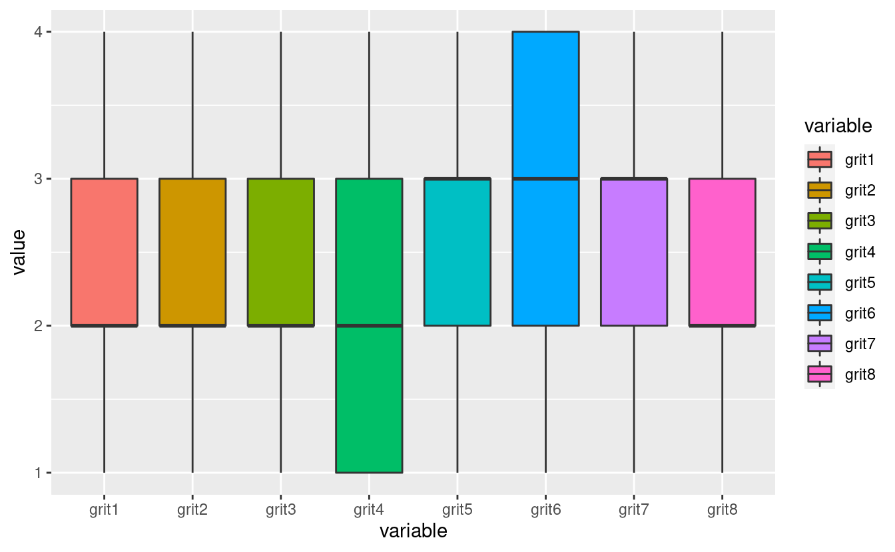
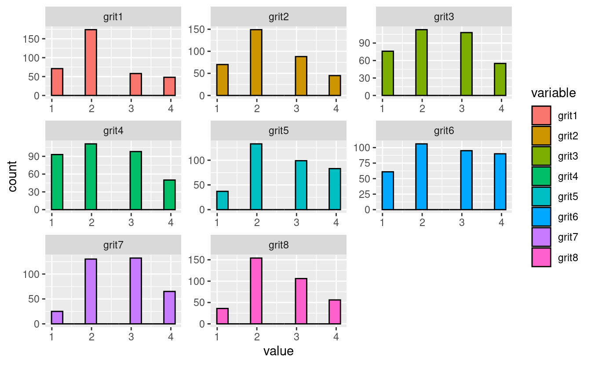
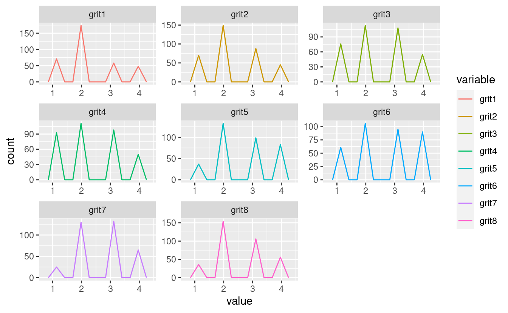

################################################## 

################################################## 

GRIT DESCRIPTIVE STATISTICS
===========================

Descriptivos GRIT continuous.
-----------------------------

<pre class='chroma'><code class='language-r' data-lang='r'>#&gt; # A tibble: 8 × 10
#&gt;   skim_type var    mean    sd    p0   p25   p50   p75  p100 hist 
#&gt;   &lt;chr&gt;     &lt;chr&gt; &lt;dbl&gt; &lt;dbl&gt; &lt;dbl&gt; &lt;dbl&gt; &lt;dbl&gt; &lt;dbl&gt; &lt;dbl&gt; &lt;chr&gt;
#&gt; 1 numeric   grit1  2.24 0.928     1     2     2     3     4 ▃▇▁▂▂
#&gt; 2 numeric   grit2  2.31 0.932     1     2     2     3     4 ▃▇▁▅▂
#&gt; 3 numeric   grit3  2.40 0.994     1     2     2     3     4 ▆▇▁▇▃
#&gt; 4 numeric   grit4  2.30 1.01      1     1     2     3     4 ▇▇▁▇▃
#&gt; 5 numeric   grit5  2.65 0.955     1     2     3     3     4 ▂▇▁▆▅
#&gt; 6 numeric   grit6  2.61 1.05      1     2     3     4     4 ▅▇▁▇▇
#&gt; 7 numeric   grit7  2.67 0.856     1     2     3     3     4 ▂▇▁▇▃
#&gt; 8 numeric   grit8  2.52 0.880     1     2     2     3     4 ▂▇▁▆▃</code></pre>

SÓLO SE ANALIZARÁN ESTAS DOS PRUEBAS QUE YA ESTÁN VALIDADAS PARA LOS INFORMES: grit (va de grit1-grit8).
--------------------------------------------------------------------------------------------------------

RANGOS: BAJO (1 - 4.5), MEDIO (4.6 - 6.1) Y ALTO (6.2 -- 8.0)
-------------------------------------------------------------

EMPF (EMPF1-EMPF35). RANGOS: BAJO (5 -- 17), MEDIO (18 -- 20), ALTO (21 -- 22) Y SUPERIOR (23 -- 25).
-----------------------------------------------------------------------------------------------------

