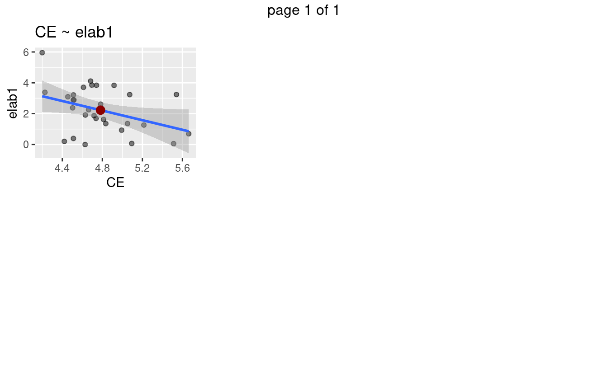

TORRANCE SUBDIMENSIONES
=======================

Notas
-----

-   Dataset Torrance ya completo
-   Ocho correlaciones encontradas
-   El num de correlaciones aumento
-   Todas entre 0.35 y 0.6
-   Vease seccion Torrance-Raven, desapareceron las correlaciones parciales \#\# Datos muy disperson en attencion
-   Los scatterplot muestran poca agrupacion alrededor de la linea de regresion
-   Da algo de desconfianza

### Frustracion

-   A mas frustraci'on mas elab3.
-   Super interesante, a mas emocion negativa mas creatividad

<pre class='chroma'><code class='language-r' data-lang='r'>#&gt; [1] "elab3 fru"
#&gt; [1] "orig3 attfoc"
#&gt; [1] "elab1 attshi"
#&gt; [1] "orig3 attcon"
#&gt; [1] "flui3 attcon"
#&gt; [1] "elab3 dis"
#&gt; [1] "elab1 fea"
#&gt; [1] "orig3 fea"
#&gt;       act       fru app     attfoc     attshi     attcon       dis sth
#&gt; orig1  NA        NA  NA         NA         NA         NA        NA  NA
#&gt; elab1  NA        NA  NA         NA -0.5303203         NA        NA  NA
#&gt; orig2  NA        NA  NA         NA         NA         NA        NA  NA
#&gt; flui2  NA        NA  NA         NA         NA         NA        NA  NA
#&gt; elab2  NA        NA  NA         NA         NA         NA        NA  NA
#&gt; flex2  NA        NA  NA         NA         NA         NA        NA  NA
#&gt; orig3  NA        NA  NA -0.3726471         NA -0.4423187        NA  NA
#&gt; flui3  NA        NA  NA         NA         NA -0.3667476        NA  NA
#&gt; elab3  NA 0.4049024  NA         NA         NA         NA 0.3993255  NA
#&gt; flex3  NA        NA  NA         NA         NA         NA        NA  NA
#&gt;             fea hip imp inh lip per sad shy smi
#&gt; orig1        NA  NA  NA  NA  NA  NA  NA  NA  NA
#&gt; elab1 0.4068448  NA  NA  NA  NA  NA  NA  NA  NA
#&gt; orig2        NA  NA  NA  NA  NA  NA  NA  NA  NA
#&gt; flui2        NA  NA  NA  NA  NA  NA  NA  NA  NA
#&gt; elab2        NA  NA  NA  NA  NA  NA  NA  NA  NA
#&gt; flex2        NA  NA  NA  NA  NA  NA  NA  NA  NA
#&gt; orig3 0.3656641  NA  NA  NA  NA  NA  NA  NA  NA
#&gt; flui3        NA  NA  NA  NA  NA  NA  NA  NA  NA
#&gt; elab3        NA  NA  NA  NA  NA  NA  NA  NA  NA
#&gt; flex3        NA  NA  NA  NA  NA  NA  NA  NA  NA</code></pre>

TORRANCE DIMENSIONES AMPLIAS (broad dims)
=========================================

Notas
-----

-   El predictor es EC, no SU

<pre class='chroma'><code class='language-r' data-lang='r'>#&gt; [1] "elab1 CE"
#&gt;               CE AN SU
#&gt; orig1         NA NA NA
#&gt; elab1 -0.3674601 NA NA
#&gt; orig2         NA NA NA
#&gt; flui2         NA NA NA
#&gt; elab2         NA NA NA
#&gt; flex2         NA NA NA
#&gt; orig3         NA NA NA
#&gt; flui3         NA NA NA
#&gt; elab3         NA NA NA
#&gt; flex3         NA NA NA</code></pre>

