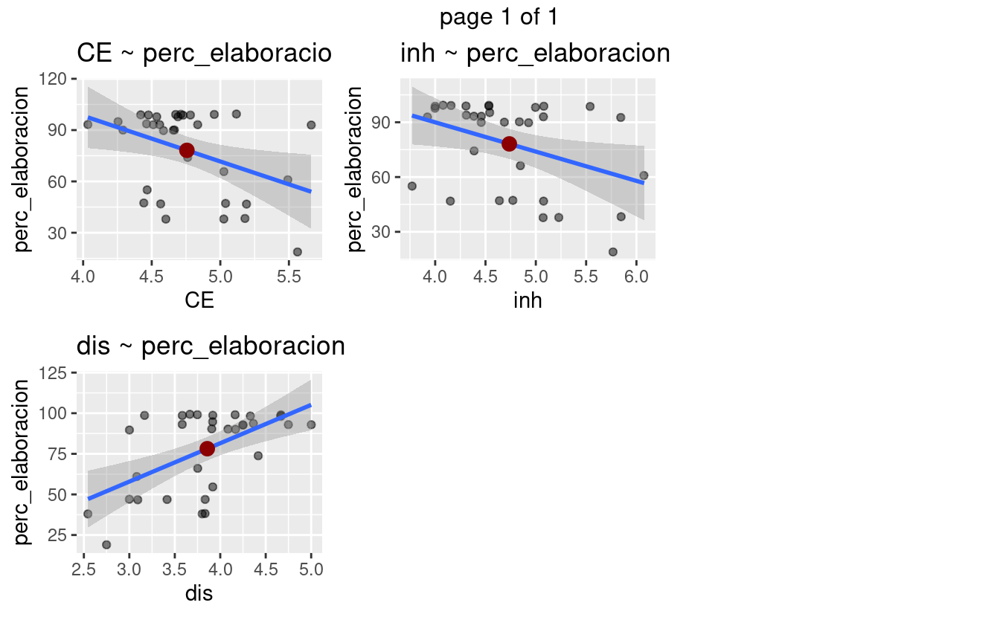
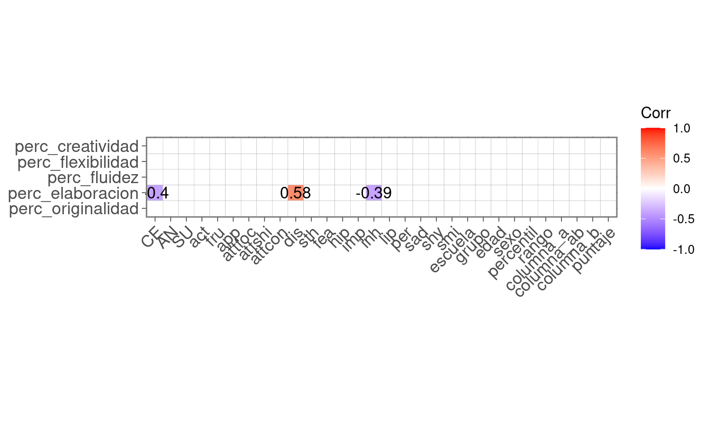
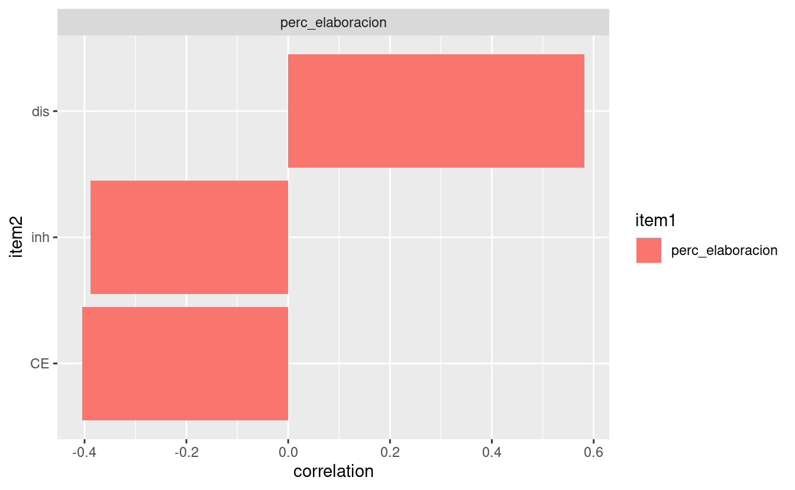
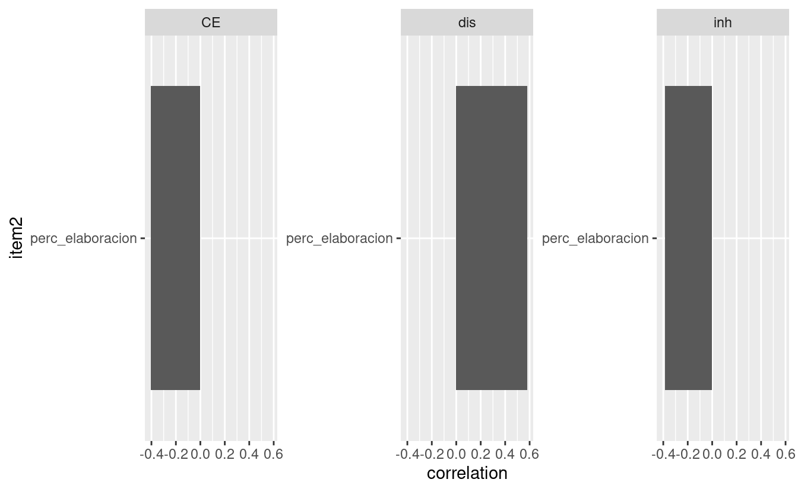
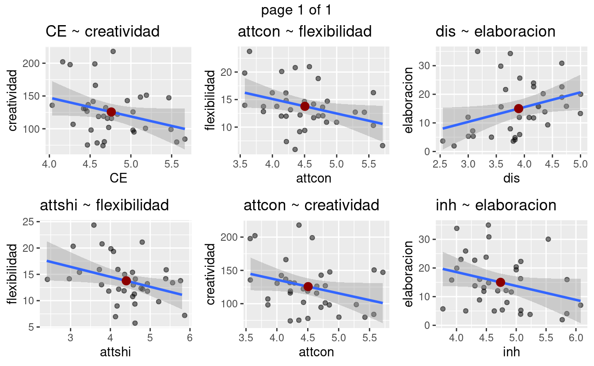
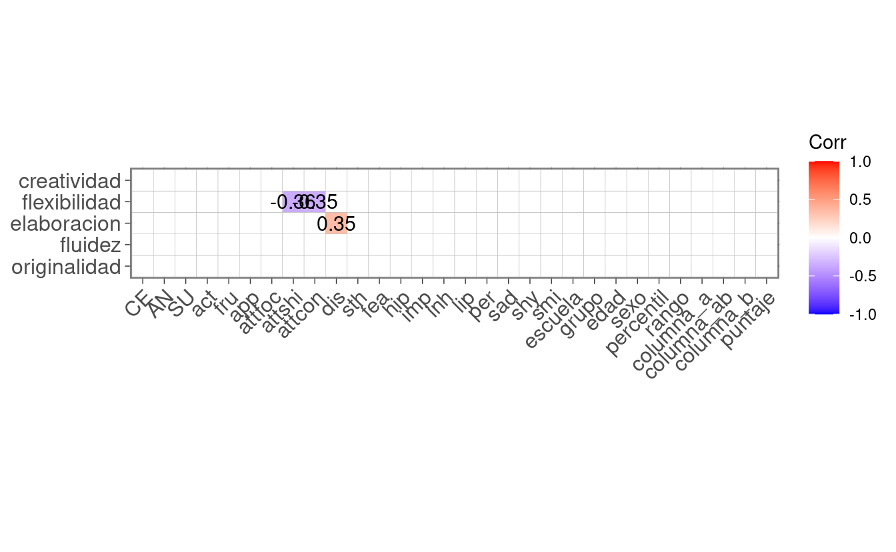
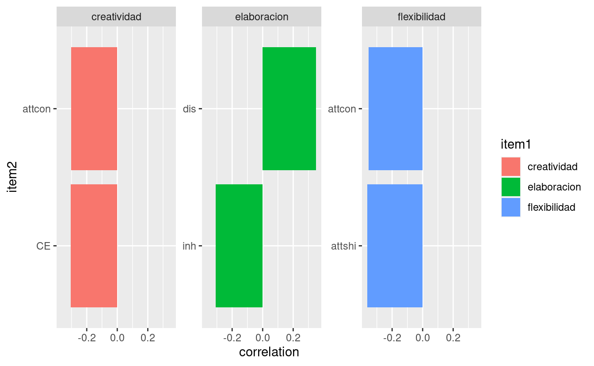
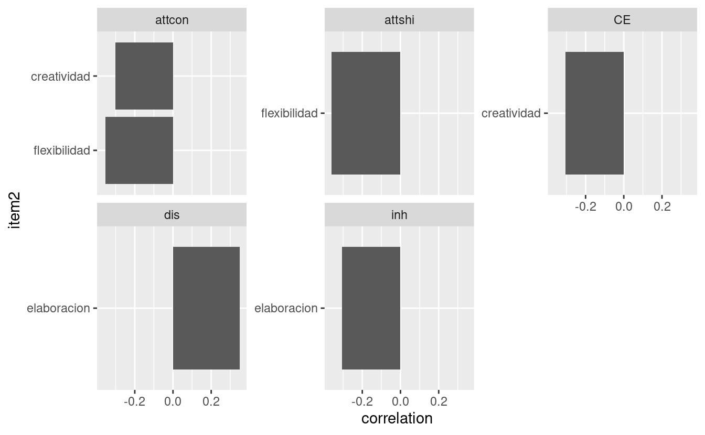

TOTALS IN TORRANCE
==================

ANALYSES BY PERCENTILE
----------------------

Notes:
------

-   Check "elaboracion" variable
-   Three children above 30

<pre class='chroma'><code class='language-r' data-lang='r'>#&gt; [1] "perc_elaboracion CE _ r = -0.40399564 _ pval = 0.02"
#&gt; [1] "perc_elaboracion dis _ r = 0.58163087 _ pval = 0"
#&gt; [1] "perc_elaboracion inh _ r = -0.38774219 _ pval = 0.026"
#&gt;                           CE AN SU act fru app attfoc attshi attcon       dis
#&gt; perc_originalidad         NA NA NA  NA  NA  NA     NA     NA     NA        NA
#&gt; perc_elaboracion  -0.4039956 NA NA  NA  NA  NA     NA     NA     NA 0.5816309
#&gt; perc_fluidez              NA NA NA  NA  NA  NA     NA     NA     NA        NA
#&gt; perc_flexibilidad         NA NA NA  NA  NA  NA     NA     NA     NA        NA
#&gt; perc_creatividad          NA NA NA  NA  NA  NA     NA     NA     NA        NA
#&gt;                   sth fea hip imp        inh lip per sad shy smi escuela grupo
#&gt; perc_originalidad  NA  NA  NA  NA         NA  NA  NA  NA  NA  NA      NA    NA
#&gt; perc_elaboracion   NA  NA  NA  NA -0.3877422  NA  NA  NA  NA  NA      NA    NA
#&gt; perc_fluidez       NA  NA  NA  NA         NA  NA  NA  NA  NA  NA      NA    NA
#&gt; perc_flexibilidad  NA  NA  NA  NA         NA  NA  NA  NA  NA  NA      NA    NA
#&gt; perc_creatividad   NA  NA  NA  NA         NA  NA  NA  NA  NA  NA      NA    NA
#&gt;                   edad sexo percentil rango columna_a columna_ab columna_b
#&gt; perc_originalidad   NA   NA        NA    NA        NA         NA        NA
#&gt; perc_elaboracion    NA   NA        NA    NA        NA         NA        NA
#&gt; perc_fluidez        NA   NA        NA    NA        NA         NA        NA
#&gt; perc_flexibilidad   NA   NA        NA    NA        NA         NA        NA
#&gt; perc_creatividad    NA   NA        NA    NA        NA         NA        NA
#&gt;                   puntaje
#&gt; perc_originalidad      NA
#&gt; perc_elaboracion       NA
#&gt; perc_fluidez           NA
#&gt; perc_flexibilidad      NA
#&gt; perc_creatividad       NA</code></pre>

### Grouped by Temperament, Raven and Other Variables

Correlation Matrix
==================

Notas
-----

-   Only Marginaly significant, p \< 0.1, correlations \# P-values Matrix All p-values
    

    <pre class='chroma'><code class='language-r' data-lang='r'>#&gt; [1] "creatividad CE _ r = -0.30428073 _ pval = 0.076"
    #&gt; [1] "flexibilidad attshi _ r = -0.36185342 _ pval = 0.033"
    #&gt; [1] "flexibilidad attcon _ r = -0.35346783 _ pval = 0.037"
    #&gt; [1] "creatividad attcon _ r = -0.30249098 _ pval = 0.077"
    #&gt; [1] "elaboracion dis _ r = 0.34945709 _ pval = 0.04"
    #&gt; [1] "elaboracion inh _ r = -0.30692221 _ pval = 0.073"
    #&gt;                      CE AN SU act fru app attfoc     attshi     attcon
    #&gt; originalidad         NA NA NA  NA  NA  NA     NA         NA         NA
    #&gt; fluidez              NA NA NA  NA  NA  NA     NA         NA         NA
    #&gt; elaboracion          NA NA NA  NA  NA  NA     NA         NA         NA
    #&gt; flexibilidad         NA NA NA  NA  NA  NA     NA -0.3618534 -0.3534678
    #&gt; creatividad  -0.3042807 NA NA  NA  NA  NA     NA         NA -0.3024910
    #&gt;                    dis sth fea hip imp        inh lip per sad shy smi escuela
    #&gt; originalidad        NA  NA  NA  NA  NA         NA  NA  NA  NA  NA  NA      NA
    #&gt; fluidez             NA  NA  NA  NA  NA         NA  NA  NA  NA  NA  NA      NA
    #&gt; elaboracion  0.3494571  NA  NA  NA  NA -0.3069222  NA  NA  NA  NA  NA      NA
    #&gt; flexibilidad        NA  NA  NA  NA  NA         NA  NA  NA  NA  NA  NA      NA
    #&gt; creatividad         NA  NA  NA  NA  NA         NA  NA  NA  NA  NA  NA      NA
    #&gt;              grupo edad sexo percentil rango columna_a columna_ab columna_b
    #&gt; originalidad    NA   NA   NA        NA    NA        NA         NA        NA
    #&gt; fluidez         NA   NA   NA        NA    NA        NA         NA        NA
    #&gt; elaboracion     NA   NA   NA        NA    NA        NA         NA        NA
    #&gt; flexibilidad    NA   NA   NA        NA    NA        NA         NA        NA
    #&gt; creatividad     NA   NA   NA        NA    NA        NA         NA        NA
    #&gt;              puntaje
    #&gt; originalidad      NA
    #&gt; fluidez           NA
    #&gt; elaboracion       NA
    #&gt; flexibilidad      NA
    #&gt; creatividad       NA</code></pre>
    

    

GRAPHICS PAIRED CORRELATIONS
----------------------------

### Grouped by Totals in Torrance

### Grouped by Temperament, Raven and Other Variables

